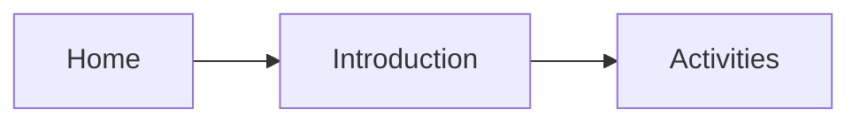

# Guide Handbook

> Learn how to use this guide.

## Website

This guide is currently hosted on the [South Hills Modding Club Guide website](https://ygledc.github.io/mc-java-mod-development-club-guide/). I recommend saving or bookmarking this website for easier access in the future.

Viewing the guide in fullscreen, windowed, or on a phone could have slight differences. The instructions below are based on viewing the guide in fullscreen mode on a computer.

## Directories

**Directories** (a list of catalogs) are on the left of the guide. You can simply access the content of what you want.

Here are some main Directories in the guide:

- **Foreword** some words about the guide and for our club members.
- **Introduction** explains how to use the guide and introduces some very basics of Java and
  Minecraft.
- **Setup** prepares the programs and project needed for mod development.
- **Activities** teaches development through hands-on practice.
- ...

There are also **sub-directories** in each directory, and perhaps sub-directory in a sub-directory. Click the Directory Name (or ">" symbol) to see the sub-directories.

Here are some sub-directories for the Directroy **Activities**:

- Activities Overview
- Act 1: Item
- Act 2: Item Features 01
- Act 3: Block
- ...

## Table of Contents

**Table of Contents** (abbreviation: TOC) (a list of contents in the directory page you are currently in) are on the right of the guide. You can simply access any small content or topic by clicking them.

Here are some TOCs in the directory (or sub-directory) **Foreword**:

- Welcome
- This Guide Is For Complete Beginners
- ...

## Search Function
You can search for any content in the guide by typing key words in the **search bar** on the top right.

## Color Mode
You can switch the **color theme** of the guide by clicking the "sun" or "moon" icon next to the search bar.

## Mermaid Visualization

**Mermaid** is a tool that transfers instructions into diagrams. The guide uses mermaid a lot for representation of concepts and structures.


> This is an example of mermaid visualization. Click it to enlarge and exit.

## Replacement "<...>"

There would be many code templates for you in **Activities**. Usually, the guide uses "<>" sign to tell you where to replace something. For example:

```json
{
"item.<mod-id>.<item_path>": "<Name of Item That You Want to Appear In English Language>"
}
```
After replacing, for example, would be something like:
```json
{
"item.ice-cream.ice_cream_ingot": "Ice Cream Ingot"
}
```
However, sometimes, you would also need to include "<>" in some code, but don't worry about this! There would also be sample code for you to refer and check your own. 

## Boxes

The guide uses different boxes for different purposes. For example:

!!! task "What You Need To DO"
    This blue box tells what you actually need to do in Activties.

!!!concept "Concept"
    This green box introduces concepts/definitions.

!!!warning "Warning"
    This orange box warns you of something

!!!tip
    This cyan box gives tips for you

------

Nice! You have understood how to use the guide.

Let's go the next page. You can do that by simply clicking the bottom-right rectangular icon **"Next - Java"**.
