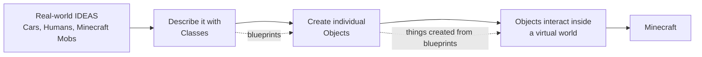
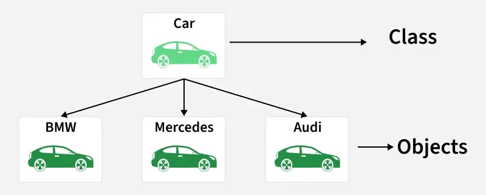
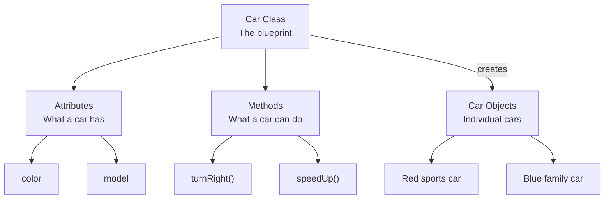
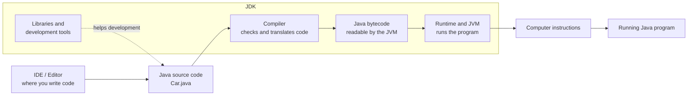

# Java

> Learn some basics of Java

> Noting too crazy! Below are some basic terms we use in Java. You are not learning how to code yet. 

> Getting familiar with what those terms mean is VERY helpful in mod development


## What Is Java

**Java** is a programming or coding language like Python, C++, etc. You can treat it as a type of language that you use to communicate with computers. Well obviously, you need to learn Java because Minecraft is built with Java code.

## Java Program & Java Source Code

**Java Programs** are Instructions written in Java, such as the mods you will build. For example, you say "Hello!" to your friend in English, but you say something like `System.out.println("Hello!")` to the computer in Java language. The instructions you write in programming languages are called **Programs**. Below is an example of a small Java Program that prints "Hello!":

```java
public class Hello {
    public static void main(String[] args) {
        System.out.println("Hello!");
    }
}
```
**Java Source Code** is the code that you write. It is readable by human. The small Java Program example above is written in Java Source Code, which we usually refers to "Java Code". When you code in Java, it basically means writing Java Source Code.

Usually, your source code are stored in files with a suffix `.java`. 

An example file: `Hello.java`

## Function

**Functions** are re-usable sets of instructions. In other words, it is a written method / task, and you can call the function to use it.

Here is an example of a function called `sayHello()`:

```java
void sayHello() {
    System.out.println("Hello!");
}
```

> Don't worry about all the werid words like "void", "System.out.println()" etc. Focus on the general idea. 

Now, suppose you want to say "Hello!" in your program. You can simply call the function you write like this:

```java
sayHello()
```

Instead of writing a bunch of code, you just simply do `sayHello()`. Isn't that cool?

Function would become extremely useful when you have to repeat a bunch of similar work in your code. Without functions, large program would look lengthy and jumbled. 

## Object Oriented Programming (OOP)

**Object Oriented Programming**, known as **OOP**, is a style, or a way of writing java code. Think of how you write English in different styles to produce different essays. 

Why write your code in this style? Because this way of writing code can help us simulate a real world on the Computer.

> You might realize something important here: Minecraft is a game, like a world, and you can do many things in Minecraft. 

See the connection here? Minecraft is the simulated world on your computer, and it is done through this way of coding.

So how do you code in this way? Well, OOP contains several important concepts: **Class and Object**. 



> visualization of OOP

> See below for more info.

## Class & Object & Attribute & Method

**Class** is a template / blueprint used to create **Objects** who have different properties called **Attributes** and different behaviors called **Methods**

For example, a class is like a blueprint for creating a specific type of car. The blueprint says, each car should have 4 wheels, a car engine, windows. Therefore, each car the factory produces following this blueprint, is called an **Object** of this **Class**.

But each car should have a color, a model, etc. They are **Attributes** (features / properties). 

Each car should be able to turn right, turn left, and speed up. This is called a **Method** (function).

This is how it looks like in Java:

```java
// The Car Class is the blueprint for making Cars.
class Car {
    // These are Attributes (what the car has).
    String color; //a color
    String model; //a model

    // This is a function! It is also a Method(function) that belongs to the Car Class.
    // It means that only cars made by this blueprint (objects from this class) can use this method
    void turnRight() {
        //code that makes the car turn right
    }
}
```
> See how we combine concepts of **Functions** here? You are on the way!




> Here is an image of an Example Car Class, image from [GFG](https://www.geeksforgeeks.org/java/object-oriented-programming-oops-concept-in-java/)



> visualization of Class structure

Another story example (skip the story if you've understand this topic): 

Now, think of this.

You are a god, and you feel lonely in the world. One day, you decide to create a species called "humans" in your world.
> You code a java class named "Humans" in Java.

You are a clever god. You don't want to specify what a human is like everytime you create a human. So, you now want a template for the species "human", or blueprint. This is called **Class** (this class is now called Human Class).
> A Class serves as the template for all its Objects.

You want all your humans to live no longer than 150 years old. That means you want all your human to have a lifespan no longer than 150 years. What should you do? 

You can add this as a property in your human template. Then, every human you create using this human template would have a maximum lifespan of 150 years old. This is an **Attribute**.
> You assign MaxlifeSpan = 150 for all your objects from the Human Class.

In this case, each individual human is called an **Object** (also known as an **Instance** of your Human Class)
> A single human is an instance of the Human Class.

A huamn can run, can walk, can eat, can see. These are called **Methods**.
> Methods are only accessible by instances of the Class or the Class itself, similar to how a rock cannot use the eat method of a human.

## Java Package

**Packages** are organized groups of classes. It is similar to having many files in a folder.

A package is like a drawer that contains many classes! 

## Java Libraries

**Libraries** are collection of pre-written Java Code that you use, it contains many **Packages**, **Classes**, and **Methods**. 

For exampe, a School (**Library**). A School has many course options (**Packages**), each course might have different classes led by teachers (**Classes**), and each class has its own grading rubric (**Methods**).

```java
/*

Library
└── Package
    └── Class
        ├── Data
        └── Method

*/
```
> visualization of relationships between them

> when we write programs (specifically mods), we are usually dealing with all of them

## Editor (IDE)

**Editor**, also known as **IDE** (Integrated Development Environment), is the platform you write Java code. Similar to how you write English sentences on paper, IDE is the "paper" for programming languages like Java. However, this "paper" is more advanced, and has additional features.

If you are taking AP CSA, Mr. Fitz might use ProjectStem to teach you. When you do your coding assignments, you actually uses the built-in IDE in ProjectStem.

The IDE we will use is called [Intellij](https://www.jetbrains.com/idea/). We'll tell you how to setup **Intellij** in the **Setup** Directory. 


## JDK (Java Development Toolkit)

**JDK**, also known as Java Development Toolkit, is literally just a toolkit. It is a collection of tools that you need to develop **Java Programs**. Think of it like this: You need your <mark class="highlight-red">stationery</mark> to write <mark class="highlight-blue">English</mark> on a <mark class="highlight-yellow">paper</mark>. Similarly, you need <mark class="highlight-red">JDK</mark> to write <mark class="highlight-blue">Java Code</mark> in an <mark class="highlight-yellow">IDE (Editor)</mark>.

This toolkit contains:

- **Compiler** : A translator that translates your **Java Code** to **Java Bytecode** (Another form of Java Code, but no longer readable by Human! A program called JVM could read it).

> Usually, if you write Java code with wrong syntax (Grammar Rules), the compiler will indicate an error.

> This is called Compile-Time Error, produced by the **Compiler**.

> Before the Compiler starts translating your code, it reads your Java Code, and report an error if your code is wrong.

- **Runtime** : An environment needed when your Java Program is running. It contains **JVM** (Java Virtual Machine), a virtual engine that translates **Java Bytecode** to instructions that your computer understand. 

> Sometimes, your code can successfully start, meaning the Compiler reads your code and translates it to Java Bytecode. 

> However, your code can go wrong when it is running in the **Runtime**. This is called Runtime Error.

- **Other Development Tools** : Java Libraries & Packages, etc.

There are different versions of JDK, and also for different operating systems (such as MacOS, Windows, etc). You will download a JDK for mod development in **Setup**.


> visualization of JDK structure

## Terminal & Command

**Terminal** is a window on your screen that you can give **commands** to your computer.

- For **MacOS**, press *"command"* + *"space"*, and type *"Terminal"*, then press *"return"*.
- For **Windows**, press *"window key"*, and type *"Terminal"*, then press *"Enter"*.

For example, running the following command in your terminal would check the defaut java version that your computer uses.

```java
java --version
```

> For more accurate wording, it checks your **Java Runtime Environment** version, which is included in your computer's **JDK**.

> If you forget what these two terms mean, quickly review this content **"JDK (Java Development Toolkit)"** again!


## Folders and Files

**Folders** organizes **Files**. Your **Source Code** is written in Java **Files**, and those files are organized in **Folders**. The **Folders** are actually the projects we are dealing with. They will eventually become mods.

> **Do You Know?**

> Packages and Folders are not the same thing, but they match. Folder is like the physical location of a place, Package is the mailing address. For example:

> Package:  com.example.mymod.item

> Folder:   com/example/mymod/item/

> 


> visualization of package vs folder

## Operating System & Processor Architecture

**Operating System** is the software (program) that manages your compuer such as **MacOS** and **Windows**.

**Processor Architecture** matches the architecture of your processor.

- For MacOS, a MacBook that uses M series chips is **AArch64**; An Intel Mac is **x64**
- For Windows, choose **x64** for Intel or AMD processor; Choose **AArch64** if you use an ARM processor, such as a Qualcomm Snapdragon chip.

> most Window computers use **x64**

!!! warning
    When you install launchers/JDKs later, if needed, you should choose the launcher/JDK version that matches your specific Operating System and Processor Architecture for best performance.

    You will lose performance and have compatibility issues if installed a mismatching version.

    Usually, those websites would detect your Operating System (and Processor Architecture sometimes). However, you should always double check! 
    
    Try search "How to check your processor architecture" in the browser if you don't know.


Nice! You've understood some basics of Java, this step is crucial because it can make your experience easier with reading java documentations. 

**Let's Go!**
