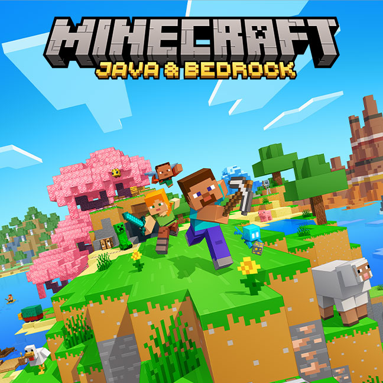
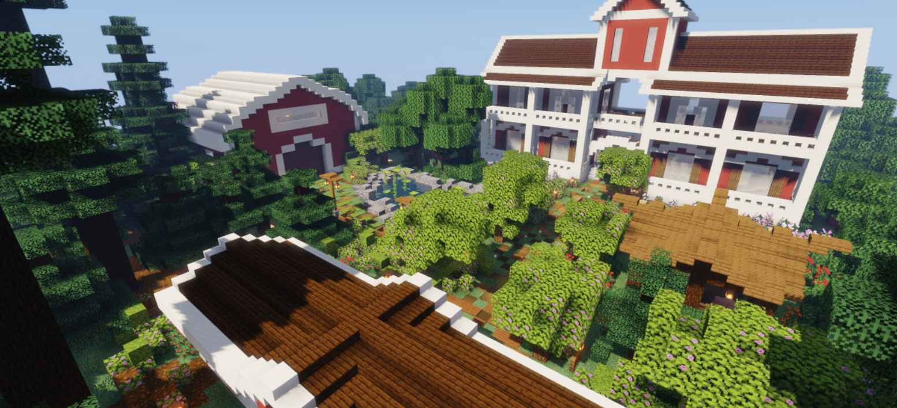

# Minecraft

> Some basics about Minecraft

> If you are familiar with Minecraft, this page should be enjoyable!

## What is Minecraft
**Minecraft** (also called MC) is a 3d sandbox game, meaning players have a great degree of freedom to explore and build. It is a typical example of **Object Oriented Programming**. Notch created Minecraft with Java, a typical OOP language that builds this virtual 3d world!

You can explore the world, build houses, construct cities, raise livestock. It is creative, and it depends on what you want to do.

With that basic, mods even offer you more possibilities.

{ width="275" }
{ width="600" }

> image from [Minecraft](https://www.minecraft.net/en-us) and [哎呦你干嘛](https://www.ayngm.com/post/400.html)


## Minecraft is OOP!

Recall that **OOP** stands for **Object Oriented Programming**. Minecraft is a typical demonstration of that. You have players, blocks, mobs such as zombies, and items in Minecraft. Each of then is represented by a **Java Class**.

More specifically, a zombie has a health of 20, that is the **Attribute** of its class; a zombie attacks players, that is the **Method** of the class. An instance (object) of the class can use the method of the class, representing how a zombie in the zombie class can attack players. 

```java
Entity
├── LivingEntity
  ├── Player
  ├── Zombie
  ├── Cow
  └── Villager
```
> a bigger class contains small classes

## Buy and Play Minecraft

It is highly recommended to spend $29.9 to purchase **Minecraft Standard Edition** [here](https://www.minecraft.net/en-us/store/minecraft-java-bedrock-edition-pc?tabs=%7B%22details%22%3A0%7D) for optimal development.

Although you don't need to buy Minecraft for initial mod development, you will eventually need to play it on a your own world.

> We recommend you to purchase Minecraft and get exposed to the game before we step into mod development. 

However, you can also choose to start develop mods because you can play a Minecraft demo with the development tools.

If this is the thing you want to do, it won't be too late to jump in then. 

 More info about downloading Minecraft is in the **Setup** Directory.
