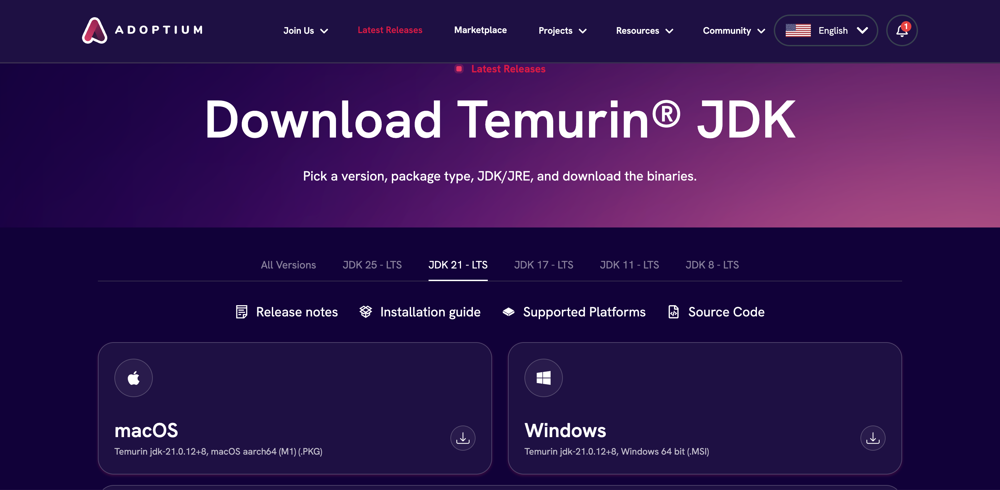
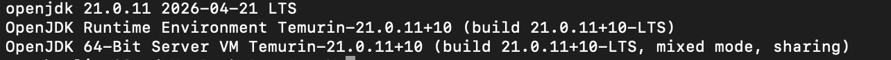

# JDK Install

> Install the JDK needed for mod development

## Temurin JDK 21

We will choose **Temurin JDK 21** for mod development.

> You can use other **JDK 21** as well, as along as it works for Fabric 1.21.1

- Click this link to direct to the download page : [Temurin JDK 21](https://adoptium.net/temurin/releases/?version=21&os=any&arch=any)



- Choose your matching [**Operating System** & **Processor Architecture**](../01-introduction/02-java.md#operating-system-processor-architecture)

> Usually, some JDK websites automatically detect them for you

> If you use a Linux System, reach out to the officers for discussion

- Click your downloaded file (it should be in your computer's **Download**), and follow the installation instructions

## Terminal Check

After you successfully install the JDK, open your terminal to check and verify by:

- For MacOS, press **"command" + "space"**, and type **"Terminal"**, then press **"return"**.
- For Windows, press **"window key"**, and type **"Terminal"**, then press **"Enter"**.

Then, run the following command in the terminal:

```text
java --version
```

It should have something like this (below is an example of **MacOS**): 



> If you have multiple JDKs on your computer, this command would only show the default, selected JDK by your terminal

> We can specify the JDK used later in IntelliJ, so no worries if it doesn't show the correct version.

-----

Nice Job!
