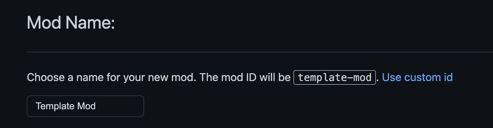
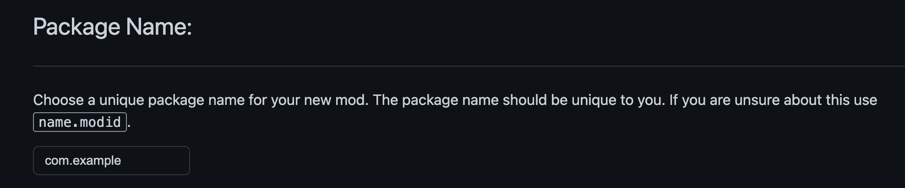
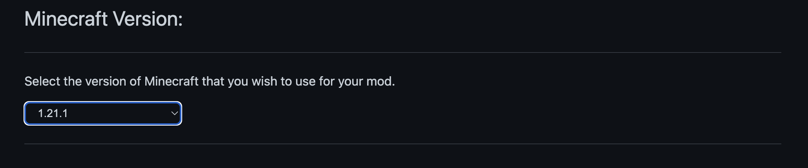
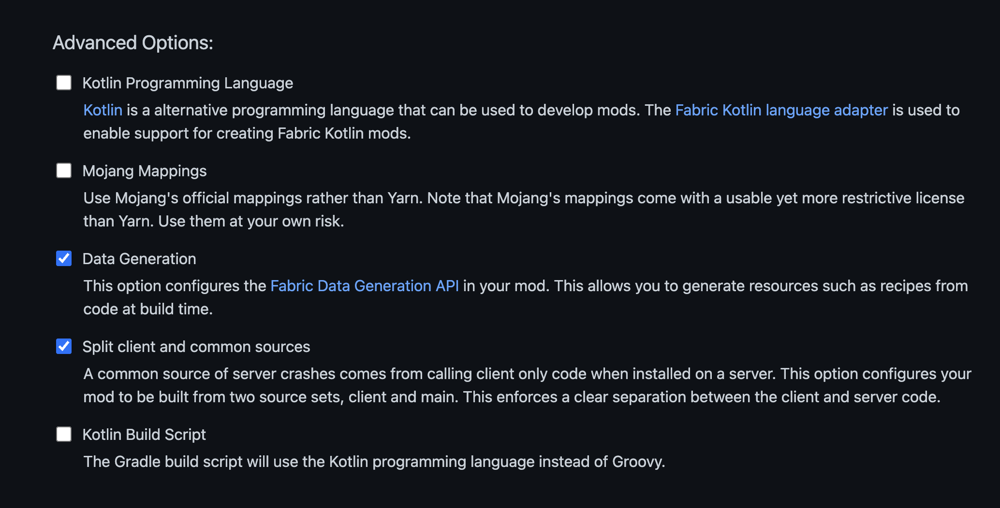
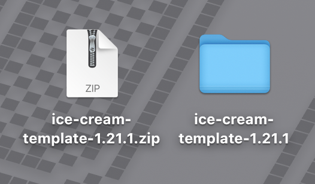
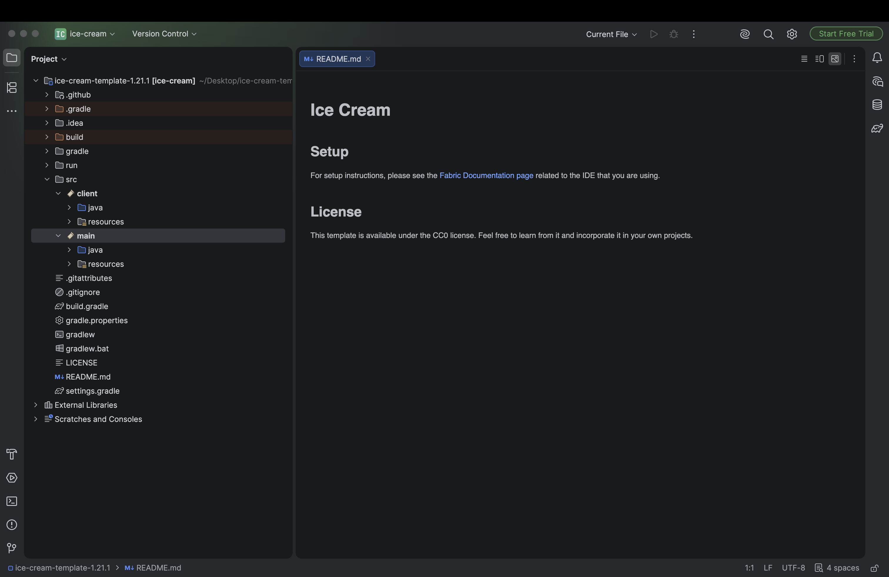
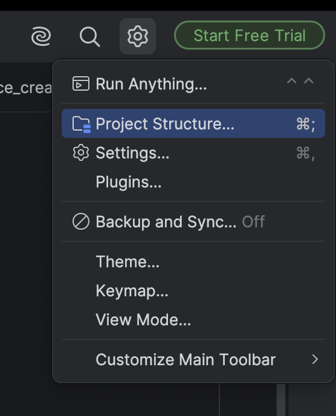
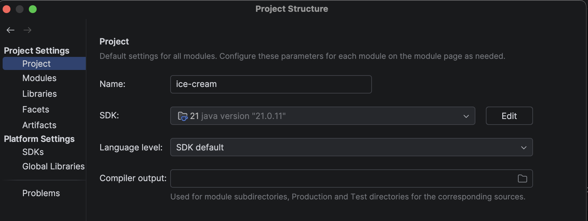
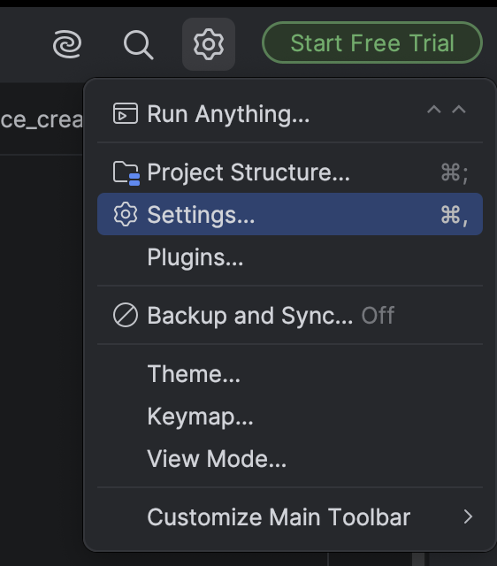
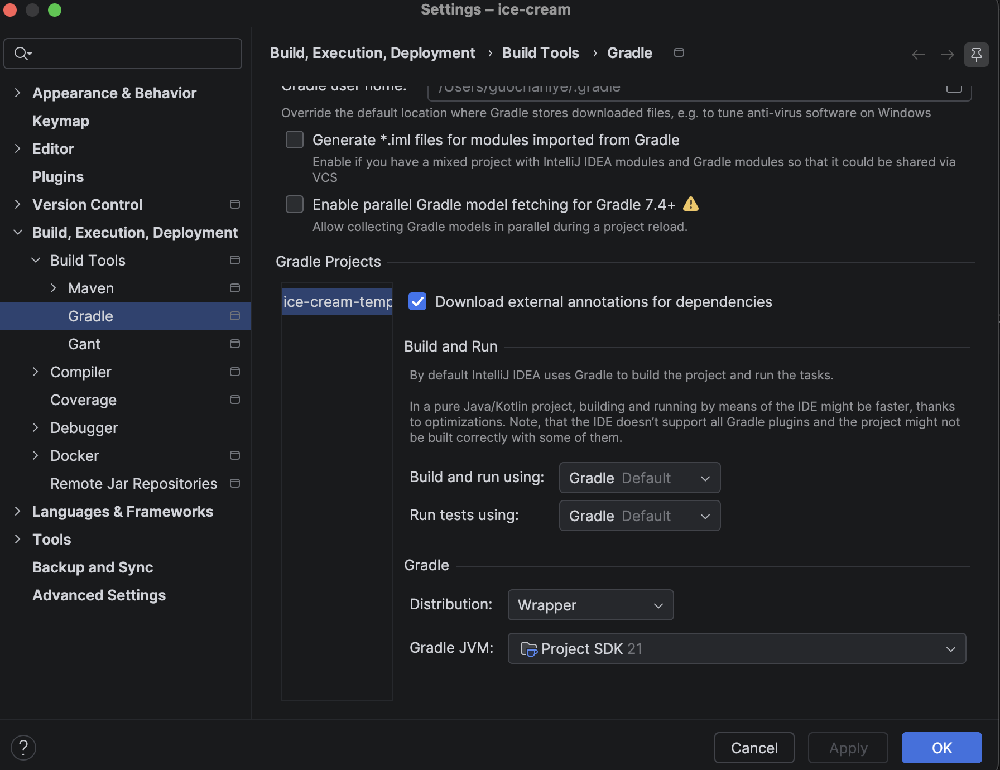

# Template Mod Generator

> Generate a starter Minecraft mod project that can be opened in IntelliJ.

## Before You Begin

Complete the previous Setup pages before generating your project:

- Minecraft & Launcher
- JDK Install
- IntelliJ Install

## Template Mod Generator

**Fabric Template Mod Generator** is a template for mod development in Fabric. It prepares the necessary tools such as **Gradle**, **Fabric Loom** for mod development.

We will later open the downloaded template with **IntelliJ** after explaining the template.

## Download Template

Click this link : [Template Mod Generator](https://fabricmc.net/develop/template/), and you'll be directed to the template page.

You will notice that there are many configurations to choose for your template.

We will go over each option below:

### Mod Name

**Mod Name** is the human-readable name of your mod. It is the name players will see in places such as the Mods menu.

It can contain capital letters and spaces.

For example:

```text
IceCream Tools
```

You can change the Mod Name later, but choosing a clear name now will help keep your project organized.

> Changing the Mod Name later may require extra work, so it is better to define the name now!

### Mod ID

**Mod ID** is the unique identifier that Minecraft and Fabric use internally to recognize your mod. It also helps prevent conflicts with other mods.

Think of how the school system recognizes you with your Student ID.

Unlike the Mod Name, the Mod ID should:

- Use lowercase letters, numbers, underscores, or hyphens
- Contain no spaces
- Be short and UNIQUE
- Describe your mod

For example:

```text
icecream_tools
```

The Mod ID is used in many places throughout your mod project. For example, your mod's resources may be stored in some place named like:

```text
assets/icecream_tools/
```

It is also used as a prefix for things added by your mod, such as:

```text
icecream_tools:icecream_sword
```
> In Minecraft, you can use command with this prefix to search for items and give you items, for example:

> /give player icecream_tools:icecream_sword 1

Choose your Mod ID carefully. It can be changed later, but you may need to update **MANY** files and references as your mod builds.

It is recommended to define your Mod Name and Mod ID from the beginning.

{ width="800" }

> By default, the template will generate your Mod ID base on your Mod Name, as shown in the screenshot above

### Package Name

**Package Name** is the name of your **package**. It organizes your Java classes, and prevents them from conflicting with classes from other mods.

Similarly, Google Map would be confused if two location have identical address. So, your package name should be unique to prevent conflicting issues.

A Package Name should:

- Use lowercase letters
- Separate each section with a period
- Contain no spaces or hyphens
- Be UNIQUE to you
- Usually starts with "com." (a convention in package naming)
- Usually, avoid underscores (a convention in package naming)
- Package Name doesn't need to be as the same as Mod ID

A common format is:

```text
com.yourname.modid
```

For example:

```text
com.rosa.icecreamtools
```

The Package Name will appear at the beginning of your Java files:

```java
package com.rosa.icecreamtools;
```

If you own a website domain, Java convention is to reverse the domain.

For example, `example.com` becomes `com.example`. 

For our projects, you can use your name or username instead.

{ width="800" }

### Minecraft Version

**Minecraft Version** determines which version of Minecraft your mod is built for.

Mods are not automatically compatible with every Minecraft version. A mod created for Minecraft 1.21.1 may not work on Minecraft 1.20.1 or another version without changes.

For our club projects, select:

```text
1.21.1
```
!!! warning
    Do not choose **1.21.10**! They are not the same.


Using the same version ensures that everyone follows the same tutorials and uses compatible versions of Minecraft, Fabric, and Java. Our Minecraft 1.21.1 projects use **JDK 21**.

{ width="800" }

### Advanced Options

The **Advanced Options** change how the generated project is configured and organized. They are just some settings for development.

{ width="800" }

> Check the two boxes as shown in the image above; They are our default settings for most of our projects.

> We will not learn options related to Kotlin at this point.

#### Data Generation

**Data Generation**, also called **Data Gen** or **Datagen**, allows Java code to automatically create **JSON** (a type of file ending with ".json") resource files for your mod.

Minecraft mods use **JSON** files for things such as:

- Recipes
- Loot tables
- Block states
- Item and block models
- Tags
- Advancements
- Language entries

Without Data Gen, you create and maintain these JSON files manually.

With Data Gen, you write Java code that generates them for you.

Enabling this option prepares the project with the files and tasks needed to run Data Generation. You can learn more in the [Fabric Data Generation documentation](https://docs.fabricmc.net/develop/data-generation/setup).

> the guide will teach you data gen for larger projects when necessary; for smaller projects and activities, we write JSON files manually.

#### Mojang Mappings

Minecraft's code originally contains short names that are difficult to understand. **Mappings** translate those names into readable class and method names that mod developers can use.

The **Mojang Mappings** option configures the project to use the official names published by Mojang. Fabric projects may instead use another mapping system called **Yarn**.

> Code examples written with Mojang Mappings may use different names from examples written with Yarn though both projects use the same Minecraft version. 

> Our guide will mostly use **Yarn**.

#### Split Client and Common Sources

Minecraft mod code can run in two environments:

- The **client** : displays graphics, screens, controls, sounds, and other player-side features.
- The **server** : manages the world, entities, game rules, and multiplayer logic.

The **Split client and common sources** option separates your project's Java code into two main locations:

```text
src/main/java/
src/client/java/
```

> src stands for "Source Code", recall that "Java Source Code" is just the code that you write

`src/main/java` contains **common code** that can run on both the client and server. `src/client/java` contains **client-only code**, such as rendering, screens, keyboard controls, client initialization, etc.

Splitting the sources helps prevent client-only code from accidentally running on a dedicated server, which will cause the server to crash. However, it also introduces an additional project structure for beginners to learn.

> We will check this box! It is better to develop a good habit at the beginning. 

##  Open Template In IntelliJ

Make sure that you've followed the instructions to create your mod template. 

- Click Download.
- Unzip the downloaded zip file. The template zip file should become a folder:

{ width="500" }

Above is an example template created with the following configurations:

> - Mod Name: Ice Cream
- Mod ID: ice-cream
- Package Name: com.ygledc.icecream
- Version: 1.21.1
- Advance Option: Check only "Data Generation" and "Split client and common sources"

- Open IntelliJ
- Select **Open** at the top right corner
- Choose the **Folder** and click open
- Trust File

Now, you should enter a page like this:



##  SDK Check

Now, we need to check if IntelliJ uses the correct JDK we've inatlled. 

> If you use a different JDK than the guide, make sure it is JDK 21. 

- Click the **Setting Icon** in the Top Right Corner, and click **Project Structure**:

{ width="400" }

- Then, select **Project** and confirm that it uses JDK 21 in **SDK**.



> Windows and MacOS may have slight differences in display

> If it doesn't show something related to JDK 21, you would have to manually select. You can either click the drop down icon (it should contain a list of **Detected SDKs**), or click **Edit** to choose the path. Remember to click **OK** to save changes.

> Again, path/display name could have slight differences between Windows and MacOS, since need to install different versions of JDK 21 for different Operating Systems

##  Gradle JVM Check

- Then, click the **Setting Icon** again, and click **Settings**:

{ width="400" }

- Select **Gradle** under **Build, Execution, Deployment** -> **Build Tools** -> **Maven** -> **Gradle**, and scroll down. Then, check **Gradle JVM**. It should use the same **SDK** that you've checked in the previous step:

{ width="700" }

- Click **OK** to save changes.

> It is recommended to check both SDK and Gradle JVM before starting your mod project every time!

You've gone this far! Nice job.

Now, you are prepared for Activity 1.


