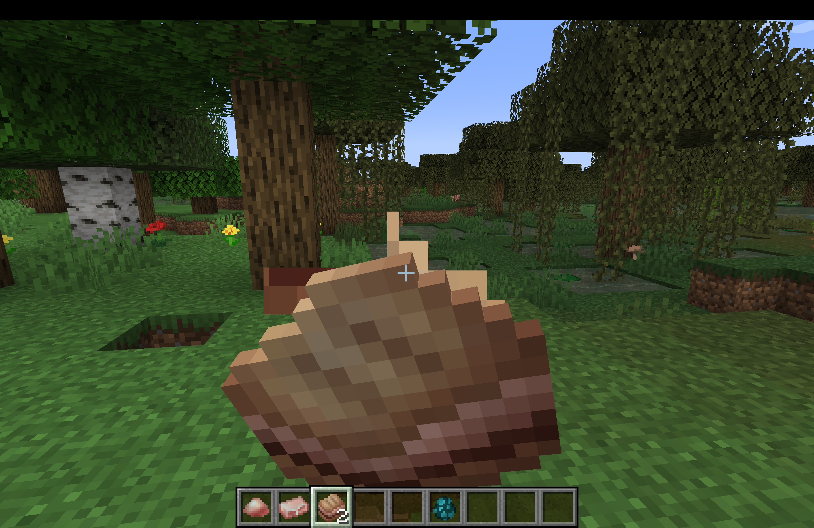
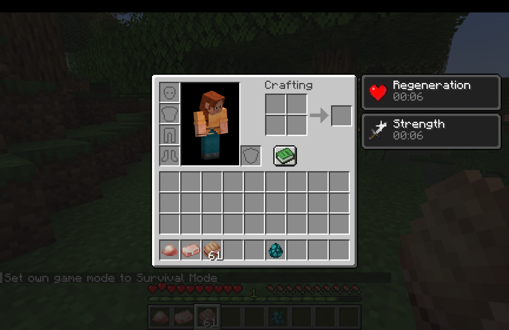
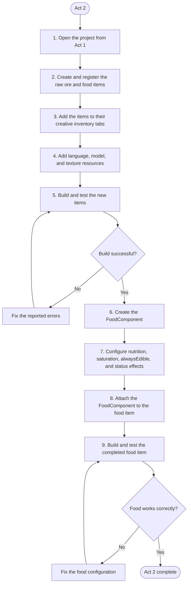

# Act 2: Item Features 01

> Act 2 uses your work from Act 1

> Learn to add some custom features for items!

> If you feel stuck, it is recommended to reach out for help in GC or Discord. You can also make good use of your search engine!

## Objective & Introduction

You will know how to create two new items, one as a food that has food properties with status effects, and one that serves as the raw ore of your item from Act 1. This is also preparing for Act 3.

Specifically, we will create a **Food Item** and a **Raw Ore** for our mod. For tutorial purposes, this **Food Item** should be what you imagine you can get after smelting your **Act 1 Item (Gem/Ingot)** in the furnace. The **Raw Ore** should be the raw version of your **Act 1 Item (Gem/Ingot)**.

In short, these three items should follow this order by smelting them in the furnace, for example:


Thanks to Rosa, we will use her art resource "Ice Cream Resource Pack", `act2_01.png` and `act2_02.png` for this activity. They are textures of **Raw Ice Cream** and **Ice Cream Burnt**!

{ .pixel-art width="150" }
{ .pixel-art width="150" }

> [Download the art resource](../assets/resource/Ice_Cream_Resource_Pack.zip)

> The art resources are only for club guide and play use. If you want to use them for other purposes, you should check out [Club Artist Contributions](../06-credits/02-club-artist-contributions.md) for specifc permissions of each author.

You can also create your own, which is recommended if you want your final product to become a personal comprehensive mod! Read the Art Resource Requirement for Act 2 below.

## Art Resource Requirement

You should prepare two textures:

- Raw version of your Act 1 Item (gem/ingot), such as the relationship between Minecraft's raw iron ore and iron ingot

{ .pixel-art width="150" }

> Minecraft's raw iron ore

- A food item that you imagine can be smelt from your Act 1 Item (gem/ingot)
> I know this sounds weird. For example, ice cream ingot can be smelt to ice cream burnt! Use your imagination...

Must be at least `16 x 16` **Pixel Grid** size, with **Transparent Background**. You can increase the resolution by 2 each time. Acceptable resolutions are: `16x16`, `32x32`, `64x64`, `128x128`, etc. We recommend `16x16` or `32x32` for Act 2.

Must be a **PNG** file.

## 1. Setup
> Make sure you have followed all instructions in [Template Mod Generator](../02-setup/04-template-mod-generator.md) to set up properly in IntelliJ.

> Complete Act 1 first!

!!!task
    Open your project folder for Act 1 in IntelliJ.

Below are some general tips for you!

It is recommended to do so at the beginning of Mod Development.

!!!tip
    Have a separate piece of paper out (or a doc opened), and write your mod's info on it, including your **Mod Name, Mod ID, and Package Name**. This would greatly help you recognize code later in complex structures.

!!!tip
    Have a separate piece of paper out (or a doc opened), and write your mod's items info on it when you code them, such as the `ITEM_NAME`, `item_path`, `mod-id:item_path`, etc.

## 2. Create Your Items

This is the exact same process from Act 1! You are basically repeating the steps for the two new items. It's a chance for you to practice what you've learned from Act 1.

There would be only 1 small change from Act 1, which will be indicated below.

We don't copy the whole content from Act 1. Instead, we have the main steps for completing this task below, also with the templates you might need, and my example.

Make sure you follow the below instructions! The indicated change and some new concepts are also in there.

### Steps & Template

* Every **Item** (object) needs a class. We use the default Minecraft **Item** class.

* You also need an **Organizer Class** for your items, a place where you instantiate your items, which you already have -> **ModItems**.

* You need methods such as the **register method** to register and create items, which you already have. Here is the template for instantiation:

!!!task "Instantiate and register your items"
    ```java
    public static final Item <ITEM_NAME> = register("<item_path>",
            new Item(new Item.Settings()));
    ```

My example:

```java
public static final Item RAW_ICE_CREAM = register("raw_ice_cream",
        new Item(new Item.Settings()));

public static final Item ICE_CREAM_BURNT = register("ice_cream_burnt",
        new Item(new Item.Settings()));
```

* You need a method to add items to the inventory, which you already have -> **initialize()**.

But Wait! Remember that one of our items in Act 2 is a food item? Which means, you would want to add it to the Food Tab in the inventory, not the Ingrendients Tab.

Therefore, we would want to modify the **initialize()** method.

We already have the code to register items to the Ingredient Tab. Similarly, we only need to add some new lines of code for the Food Tab.

Minecraft uses **FOOD_AND_DRINK** to represent the food tab. You can add the below code in your **initialize()**:

!!!task "Register food item to Inventory"
    ```java
    ItemGroupEvents.modifyEntriesEvent(ItemGroups.FOOD_AND_DRINK)
            .register(entries -> {
                entries.add(<ITEM_NAME1>);
            });
    ```

Your **initialize()** method now contains two **ItemGroupEvents**! It should look something like this:

```java
public static void initialize() {
    ItemGroupEvents.modifyEntriesEvent(ItemGroups.INGREDIENTS) //INGREDIENTS
            .register(entries -> {
                entries.add(ICE_CREAM_INGOT);
                entries.add(RAW_ICE_CREAM); //the raw ore item
            });

    ItemGroupEvents.modifyEntriesEvent(ItemGroups.FOOD_AND_DRINK) //FOOD_AND_DRINK
            .register(entries -> {
                entries.add(ICE_CREAM_BURNT); //the food item
            });

}
```

## 3. Add Resources

This is the exact same process from Act 1! You are basically repeating the steps for the two new items. It's a chance for you to practice what you've learned from Act 1.

There would be only 1 small change from Act 1, which will be indicated below.

We don't copy the whole content from Act 1. Instead, we have the main steps for completing this task below, also with the templates you might need, and my example.

Make sure you follow the below instructions! The indicated change and some new concepts are also in there.

### Steps & Template

* For a basic item, you need 3 resources: **Lang JSON**, **Model JSON**, and **Texture PNG**

* **Lang JSON** : You already have **en_us.json**! So, in `src/main/resources/assets/mod-id/lang/en_us.json`, add two new key-value pairs for your two new items. Here is how you do for multiple items:

!!!task "Modify Lang JSON"
    ```json
    {
        "item.<mod-id>.<item_1_path>": "Item 1 Displayed Text Name",
        "item.<mod-id>.<item_2_path>": "Item 2 Displayed Text Name",
        "item.<mod-id>.<item_3_path>": "Item 3 Displayed Text Name"
    }
    ```

You might notice the weird trailing comma "**,**" after each key-value pairs except the last one. Here is the new concept:

!!! concept "JSON Objects"
    **JSON Objects**

    JSON Object is like dictionary, which is a key-value pair in the format `"key":"value"`.

    JSON Objects are separated by comma, therefore, you usually don't need a comma after the last JSON Object.

My example:
```json
{
    "item.ice-cream.ice_cream_ingot": "Ice Cream Ingot",
    "item.ice-cream.raw_ice_cream": "Raw Ice Cream",
    "item.ice-cream.ice_cream_burnt": "Ice Cream Burnt"
}
```

* **Model JSON** : You would need two new model jsons for your new items in `src/main/resources/assets/mod-id/models/item/`. Therefore, select **item** directory, click **"+"** at the top of the left panel, choose **file**, and create your json files following the naming rules.

Naming Rules:

!!!task "Create and name your Models JSON"
    ```text
    <item_path>.json
    ```

My example:

```text
raw_ice_cream.json
ice_cream_burnt.json
```

After creating the file, we are going to write the JSON code for them. In Act 1, we've learned how to create a basic model for a 2d item using Minecraft's existing model:

!!!task "Write your Models JSON"
    ```json
    {
        "parent": "minecraft:item/generated",
        "textures": {
            "layer0": "<mod-id>:item/<item_path>"
        }
    }
    ```


My examples:

```json
{
    "parent": "minecraft:item/generated",
    "textures": {
        "layer0": "ice-cream:item/raw_ice_cream"
    }
}
```
```json
{
    "parent": "minecraft:item/generated",
    "textures": {
        "layer0": "ice-cream:item/ice_cream_burnt"
    }
}
```

* **Texture PNG** : add your texture png files into `src/main/resources/assets/mod-id/textures/item/`, and rename them following the naming rules.
!!!task "Add and name your Texture PNGs"
    ```txt
    <item_path>.png
    ```
My example:
```txt
raw_ice_cream.png
ice_cream_burnt.png
```

## 4. Checkpoint and Test 01

Make sure you've completed all code before!

We will create a checkpoint of our work by running a **gradle** command.

This is important in Mod Development. This command can ensure that all your code so far can be successfully built into an actual mod! In larger projects, checkpoints are needed frequently.

!!! task "Build your mod"
    Click the Terminal icon in the bottom-left corner. It looks like a box containing `>_`.

    After openning the terminal window, enter the following command and press Enter:

    ```text
    ./gradlew build
    ```

There are many ways to open a terminal, but make sure it is openned at your folder!!! For example, if you are using MacOS, you should see something like this in your terminal:
```text
YourDeviceName xxx-xxx-template-1.21.1 %
```

After running the command, wait a few seconds. It should say <mark class="highlight-green">BUILD SUCCESSFUL</mark>.

What `./gradlew build` does:

- compile your Java code by using your assigned JDK (Gradle JVM)

- check for errors

- process resources (we will add resources later)

- create the `.jar` file, which is the mod's file you download from online

Now, after a successful build, we will run a temporary Minecraft to test our mod.

!!! task "Run the Minecraft client"
    Open the Terminal from the bottom-left corner. Enter the following command and press Enter:

    ```text
    ./gradlew runClient
    ```

This command would launch a temporary Minecraft (a Minecraft development client) with your mod.

!!! task "Check the item in Inventory"
    Create a new world in **Creative Mode**. Open your inventory and look in the Ingredients tab and Food Tab for your items. You can also search for their names. You should be able to see your completed item with its texture.

However...if you try to eat your food item, it doesn't work!

That is normal, and it would be what we are doing next.

## 5. Food Properties

After having the food item, we want to add an item feature named "Food Property" to the food item. This would make it an edible item!

You might know what we will do first: Before we even do something, we need the tool for that.

### Import Classes 01

Therefore, we will import the necessary classes for developing **Food Property** for our food item.

!!!task "Import FoodComponent"
    Import `net.minecraft.component.type.FoodComponent` in `ModItems` at where your other imports are:
    ```java
    import net.minecraft.component.type.FoodComponent;
    ```

This import gives us the **FoodComponent** class, which allows us to create **FoodComponent Objects**.

This object contains all additional attributes that an **Item** needs to become a **Food Item**. We can modify the configuration of the food item by creating a **FoodComponent Object**, and pass it in as an part of the argument to the constructor of **Item Object**, which is what you've already finished creating.

This long statement alone sounds abstract. Let's take a look at the actual code.

### Create FoodComponent Object

We want to assign the FoodComponent Object to a variable, just like what we've done with the Item Objects.

Notice that this is only a FoodComponent Object that will be passed as argument, so there is no need to use our `register()` method. Therefore, you might think of using a standard constructor format.

If you remember what a standard constructor looks like, it may be this in our code:

```java
public static final FoodComponent Your_FOODCOMPONENT = new FoodComponent(...)
```

However, you are unable to assign attributes to your FoodComponent Object directly. Minecraft requires you to use something called **Builder Pattern** that uses the **Builder** class. It is a much clearer format, for example:

```java
public static final FoodComponent YOUR_FOODCOMPONENT = new FoodComponent.Builder()
        .AAA(...)
        .BBB(...)
        .CCC(...)
        .build();
```

**AAA().BBB().CCC()** is where you use methods from **Builder** class to do configuration. You chain those methods using **dot notation**.

In 1.21.1 Fabric (Yarn), the main FoodComponent **Builder** methods are:

| Builder Methods (DataType parameterName) | Effect | Example |
| --- | --- | --- |
| `nutrition(int nutrition_value)` | determines hunger points restored | `nutrition(6)` |
| `saturationModifier(float saturationModifier)` | determines saturationModifer | `saturationModifier(0.6f)` |
| `alwaysEdible()` | can be eaten even when full | `alwaysEdible()` |
| `snack()` | make it quicker to eat | `snack()` |
| `statusEffect(StatusEffectInstance effect, float chance)` | a chance to apply a status effect after eaten | `statusEffect(new StatusEffectInstance(StatusEffects.STRENGTH, 200, 0), 1.0f)` |

Some facts to know:

* Minecraft's full hunger bar is 20 nutrition points
* Minecraft's saturation has a maximum of 20, and it is determined by this formula: ==*saturation gained = nutrition x saturationModifier x 2*==
* StatusEffectInstance object represents one specific status effect. You will create one later.
* Remember that float needs `f` at the end, else Java treat it as **double**
* A 100% chance is a value of 1, which is `1.0f`

!!!concept "float 'f'"
    You need to add an `f` at the end to tell Java it is a **float**! Or it would treat it as **double**.
    
    For example, `0.5f` is a float value of `0.5`

!!!task "Create food component"
    Create your **Food Component** in `ModItems` with a *nutrition value*, a *saturation modifier*, and make it *always edible*. Place it near other static fields (your other creation of items), but it ==must exist before food item==:
    ```java
    public static final FoodComponent <FOOD_COMPONENT_NAME> = new FoodComponent.Builder()
        .nutrition(<int Nutrition_Value>)
        .saturationModifer(<float Saturation_Modifier>)
        .alwaysEdible()
        .build();
    ```
    
!!!warning
    Java runs static fields (attributes) from top to bottom. We'll need to attach this food component to our food item's instantiation later, so it shoulod exist before Java runs the code for food item. For example:

    ```java
    public static final FoodComponent ICE_CREAM_BURNT_COMPONENT = ...;
        //food configuration for ice cream burnt
        //has to be before ICE_CREAM_BURNT

    public static final Item ICE_CREAM_BURNT = ...;
    ```

Some components:

* `FOOD_COMPONENT_NAME` : the name of the variable the refers to your Food Component object. It is recommended to name it as: `FOOD_ITEM_NAME_COMPONENT` (e.g., `ICE_CREAM_BURNT_COMPONENT`)
* `int Nutrition_Value` : an **int** that represents the hunger points restored
* `float Saturation_Modifier` : a **float** that represents the saturation modifier

!!!concept "float 'f'"
    You need to add an `f` at the end to tell Java it is a **float**! Or it would treat it as **double**.
    
    For example, `0.5f` is a float value of `0.5`

My example:

```java
public static final FoodComponent ICE_CREAM_BURNT_COMPONENT = new FoodComponent.Builder()
        .nutrition(10)
        .saturationModifier(0.6f)
        .alwaysEdible()
        .build();
```

### Import Classes 02

Now, we want the our food item to offer some status effects after my food item is eaten.

To do that, we need to use `statusEffect(...)`. However, it takes in a `StatusEffectInstance` object, and to create that object, it takes in a a `StatusEffects` which represents the effect you are applying (e.g., Strength, Speed, etc).

It seems like we need to import two classes!

!!!task "Import classes"
    Import the two classes in `ModItems` at where your other imports are:
    ```java
    import net.minecraft.entity.effect.StatusEffects;
    import net.minecraft.entity.effect.StatusEffectInstance;
    ```

* `StatusEffects` : gives and represents the type of effect you need, such as:
```java
StatusEffects.STRENGTH
StatusEffects.REGENERATION
```
> See more in Dictionary

* `StatusEffectInstance` : gives you the `StatusEffectInstance` class so you can create a `StatusEffectInstance` object.

### Add Status Effects

After having the tools we need, inside your build pattern of the instantiation of your Food Component using `statusEffect(...)`.

To instantiate a `StatusEffectInstance` object, we pass in 3 parameters, and follow the normal constructor format:
```java
new StatusEffectInstance(StatusEffects.<EFFECT_NAME>, <int Duration_In_Ticks>, <int Amplifier>)
//follows the general constructor format

new StatusEffectInstance(
    StatusEffects.<EFFECT_NAME>,
    <int Duration_In_Ticks>,
    <int Amplifier>
    )
//this one better fits the screen
```

* `EFFECT_NAME` : the name of effect; for example, Minecraft uses `STRENGTH` to represents Strength. Together with dot notation, `StatusEffects.STRENGTH` is one filed (attribute) of `StatusEffects` class that represents the Strength Effect.

* `int Duration_In_Ticks` : how long (how many ticks) the effect lasts. It should be an **int** value.
> Minecraft runs about 20 ticks per second, so `20 ticks = 1 sec` in Minecraft

* `int Amplifier` : the level of effect. It should be an **int** value.
> For example: 0  → Strength I, 1  → Strength II, 2  → Strength III, 3  → Strength IV, 100 → Strength CI (101st level)

!!!task "Add the Status Effect method to the Builder Pattern"
    Now, modify your Builder Pattern by adding `statusEffect(...)` in the builder pattern of your food component. Make sure it is before `build()`

    Inside the method, instantiate your `StatusEffectsInstance` object with its constructor:
    ```java
    public static final FoodComponent <FOOD_COMPONENT_NAME> = new FoodComponent.Builder()
        .nutrition(<int Nutrition_Value>)
        .saturationModifer(<float Saturation_Modifier>)
        .statusEffect(
                new StatusEffectInstance(
                        StatusEffects.<EFFECT_NAME>,
                        <int Duration_In_Ticks>,
                        <int Amplifier>
                        ),
                        <float Chance>
                )
        .alwaysEdible()
        .build();
    ```

What if I want more effects for my food? That is doable!

You can chain another  `statusEffect(...)` method to your food component's builder pattern:

```java
public static final FoodComponent <FOOD_COMPONENT_NAME> = new FoodComponent.Builder()
    .nutrition(<int value>)
    .saturationModifer(<float value>)
    .statusEffect(
            new StatusEffectInstance(
                    StatusEffects.<EFFECT_NAME>,
                    <int Duration_In_Ticks>,
                   <int Amplifier>
                    ), <float chance>)
    .statusEffect(
            new StatusEffectInstance(
                    StatusEffects.<EFFECT_NAME>,
                    <int Duration_In_Ticks>,
                    <int Amplifier>
                    ), <float chance>)
    .alwaysEdible()
    .build();
```

Actually, it doesn't matter if you chain it in other positions of your build pattern, as long as it is before `build()`:
```java
public static final FoodComponent <FOOD_COMPONENT_NAME> = new FoodComponent.Builder()
    .statusEffect(
            new StatusEffectInstance(
                    StatusEffects.<EFFECT_NAME>,
                    <int Duration_In_Ticks>,
                    <int Amplifier>
                    ), <float chance>)
    .nutrition(<int value>)
    .saturationModifer(<float value>)
    .statusEffect(
            new StatusEffectInstance(
                    StatusEffects.<EFFECT_NAME>,
                    <int Duration_In_Ticks>,
                   <int Amplifier>
                    ), <float chance>)
    alwaysEdible()
    .build();
```
> This should work the same.

My example:
```java
public static final FoodComponent ICE_CREAM_BURNT_COMPONENT = new FoodComponent.Builder()
        .nutrition(10)
        .saturationModifier(0.6f)
        .statusEffect(
                new StatusEffectInstance(
                        StatusEffects.STRENGTH,
                        200,
                        99), 0.25f)
        .statusEffect(
                new StatusEffectInstance(StatusEffects.REGENERATION,
                        200,
                        0), 1.0f)
        alwaysEdible()
        .build();
```

My code creates a **Food Component** object that can endow the following attributes to a food item:

* Restore 10 hunger points
* Apply a saturation of 12
* Apply Strength (Level 100) for 10 seconds with a 25% chance
> I could kill a Warden with 2 single hits!
* Apply Regeneration (Level 1) for 10 seconds with a 100% chance

Howevver, this is just the food component, and we have to attach it to our food item.

!!!task "Apply Food Component to Food Item"
    Find your instantiation of the food item. Use `Item.Settings()`'s method `food()`, which accepts a food component as argument:

    ```java
    public static final Item <ITEM_NAME> = register("<item_path>",
            new Item(new Item.Settings().food(<FOOD_COMPONENT_NAME>)));
    ```

`food()` is a method of `Item.Settings()` that accepts a food component as argument.

My example:
```java
public static final Item ICE_CREAM_BURNT = register("ice_cream_burnt",
        new Item(new Item.Settings().food(ICE_CREAM_BURNT_COMPONENT)));
```

## 6. Checkpoint and Test 02

Make sure you've completed all code before!

We will create a checkpoint of our work by running a **gradle** command.

This is important in Mod Development. This command can ensure that all your code so far can be successfully built into an actual mod! In larger projects, checkpoints are needed frequently.

!!! task "Build your mod"
    Click the Terminal icon in the bottom-left corner. It looks like a box containing `>_`.

    After openning the terminal window, enter the following command and press Enter:

    ```text
    ./gradlew build
    ```

There are many ways to open a terminal, but make sure it is openned at your folder!!! For example, if you are using MacOS, you should see something like this in your terminal:
```text
YourDeviceName xxx-xxx-template-1.21.1 %
```

After running the command, wait a few seconds. It should say <mark class="highlight-green">BUILD SUCCESSFUL</mark>.

What `./gradlew build` does:

- compile your Java code by using your assigned JDK (Gradle JVM)

- check for errors

- process resources (we will add resources later)

- create the `.jar` file, which is the mod's file you download from online

Now, after a successful build, we will run a temporary Minecraft to test our mod.

!!! task "Run the Minecraft client"
    Open the Terminal from the bottom-left corner. Enter the following command and press Enter:

    ```text
    ./gradlew runClient
    ```

This command would launch a temporary Minecraft (a Minecraft development client) with your mod.

!!! task "Check the item in Inventory"
    Enter your existing world, and find your two new items. You should see your complete raw ore item, and your edible food item. Try eating it and see if it provides the effect that you specify.

    You can switch to survival mode by pressing **"T"** to open the chat window, and type in `/gamemode survival`. Sprint for a while to decrease your hunger bar, and see how your edible item restores it!

{ width="425" }
{ width="425" }

> Status Effects that are **Level 1** or greater than **Level 10** do not show Roman Numerals.

That is all for Act 2.

## Mermaid Workflow

A mermaid visualization for the general workflow.


