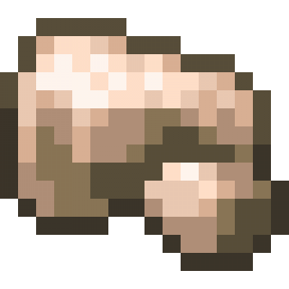

# Act 2: Item Features 01

> Act 2 uses your work from Act 1

> Learn to add some custom features for items! Specifically, learning how to add food properties and status effects for items.

> If you feel stuck, it is recommended to reach out for help in GC or Discord. You can also make good use of your search engine!

## Objective & Introduction

You will know how to create two new items, one as a food that has food properties with status effects, and one that serves as the raw ore of your item from Act 1. This is also preparing for Act 3.

Specifically, we will create a **Food Item** and a **Raw Ore** for our mod. For tutorial purposes, this **Food Item** should be what you imagine you can get after smelting your **Act 1 Item (Gem/Ingot)** in the furnace. The **Raw Ore** should be the raw version of your **Act 1 Item (Gem/Ingot)**.

In short, these three items should follow this order by smelting them in the furnace:

* Example: **Raw Ice Cream (Act2 Item, raw ore)** --> **Ice Cream Ingot (Act1 Item, ingot or gem)** --> **Ice Cream Burnt (Act2 Item, food)**

Thanks to Rosa, we will use her art resource "Ice Cream Resource Pack" - "act2_01.png" and "act2_02.png" for this activity. They are textures of **Raw Ice Cream** and **Ice Cream Burnt**!

{ .pixel-art width="150" }
{ .pixel-art width="150" }

> [Download the art resource](../assets/resource/Ice_Cream_Resource_Pack.zip)

> The art resources are only for club guide and play use. If you want to use them for other purposes, you should check out [Club Artist Contributions](../06-credits/02-club-artist-contributions.md) for specifc permissions of each author.

If you decide to create your own, read the Art Resource Requirement for Act 2 below.

## Art Resource Requirement

You should prepare two textures:

- Raw version of your Act 1 Item (gem/ingot), such as the relationship between Minecraft's raw iron ore and iron ingot

{ .pixel-art width="150" }

> Minecraft's raw iron ore

- A food item that you imagine can be smelt from your Act 1 Item (gem/ingot)
> I know this sounds weird. For example, ice cream ingot can be smelt to ice cream burnt! Use your imagination...

Must be at least **16 x 16** **Pixel Grid** size, with **Transparent Background**. You can increase the resolution by 2 each time. Acceptable resolutions are: 16x16, 32x32, 64x64, 128x128, etc. We recommend 16x16 or 32x32 for Act 2.

Must be a **PNG** file. 

## 1. Setup

Open your project folder for Act 1 in IntelliJ.

> Complete Act 1 first!

> Make sure you have followed all instructions in [Template Mod Generator](../02-setup/04-template-mod-generator.md) to set up properly in IntelliJ.

Below are some general tips for you!

It is recommended to do so at the beginning of Mod Development.

!!!tip
    Have a separate piece of paper out (or a doc opened), and write your mod's info on it, including your **Mod Name, Mod ID, and Package Name**. This would greatly help you recognize code later in complex structures.

!!!tip
    Have a separate piece of paper out (or a doc opened), and write your mod's items info on it when you code them, such as the **ITEM_NAME**, **item_path**, **mod-id:item_path**, etc. 

## 2. Create Your Items

This would be the exact same process of Act 1! You are basically repeating the steps for the two new items. 

> We will not copy the whole process from Act 1 to here. This is a chance for you to practice what you've learned from Act 1!

> There would be only 1 small change from Act 1, which will be indicated below.

You can always go back to Act 1 and review the general process of creating an item. However, we have the general workflow for completing this task below, also with the templates you might need, and my example.

Make sure you follow the below workflow! The indicated change and some new concepts are also in there.

### Steps & Template

* Every **Item** (object) needs a class. We use the default Minecraft **Item** class.

* You also need an **Organizer Class** for your items, a place where you instantiate your items, which you already have -> **ModItems**.

* You need methods such as the **register method** to register and create items, which you already have. Here is the template for instantiation:

```java
public static final Item <ITEM_NAME> = register("<item_path>",
    new Item(new Item.Settings()));
```

My example:

```java
public static final Item RAW_ICE_CREAM = register("raw_ice_cream",
    new Item(new Item.Settings()));

public static final Item ICE_CREAM_BURNT = register("ice_cream_burnt",
    new Item(new Item.Settings()));
```

* You need a method to add items to the inventory, which you already have -> **initialize()**.

But Wait! Remember that one of our items in Act 2 is a food item? Which means, you would want to add it to the Food Tab in the inventory, not the Ingrendients Tab.

Therefore, we would want to modify the **initialize()** method.

We already have the code to register items to the Ingredient Tab. Similarly, we only need to add some new lines of code for the Food Tab.

Minecraft uses **FOOD_AND_DRINK** to represent the food tab. You can add the below code in your **initialize()**:

```java
ItemGroupEvents.modifyEntriesEvent(ItemGroups.FOOD_AND_DRINK)
                .register(entries -> {
                    entries.add(<ITEM_NAME1>);
                });
```

Your **initialize()** method now contains two **ItemGroupEvents**! It should look something like this:

```java
public static void initialize() {
        ItemGroupEvents.modifyEntriesEvent(ItemGroups.INGREDIENTS) //INGREDIENTS
                .register(entries -> {
                    entries.add(ICE_CREAM_INGOT);
                    entries.add(RAW_ICE_CREAM); //the raw ore item
                });

        ItemGroupEvents.modifyEntriesEvent(ItemGroups.FOOD_AND_DRINK) //FOOD_AND_DRINK
                .register(entries -> {
                    entries.add(ICE_CREAM_BURNT); //the food item
                });

    }
```

## 3. Add Resources

This would be the exact same process of Act 1! You are basically repeating the steps for the two new items.

> We will not copy the whole process from Act 1 to here. This is a chance for you to practice what you've learned from Act 1!

> However, you would also get to know something new about JSON here.

You can always go back to Act 1 and review the general process of creating an item. However, we have the general workflow for completing this task below, also with the templates you might need, and my example.

Make sure you follow the below workflow! The indicated change and some new concepts are also in there.

### Steps & Template

* For a basic item, you need 3 resources: **Lang JSON**, **Model JSON**, and **Texture PNG**

* **Lang JSON** : You already have **en_us.json**! So, in *src/main/resources/assets/mod-id/lang/en_us.json*, add two new key-value pairs for your two new items. Here is how you do for multiple items:

```json
{
  "item.<mod-id>.<item_1_path>": "Item 1 Displayed Text Name",
  "item.<mod-id>.<item_2_path>": "Item 2 Displayed Text Name",
  ...
  "item.<mod-id>.<item_n_path>": "Item n Displayed Text Name"
}
```

You might notice the weird trailing comma "**,**" after each key-value pairs except the last one. Here is the new concept:

!!! concept
    **JSON Objects**

    JSON Object is like dictionary, which is a key-value pair in the format =="key":"value"==.

    JSON Objects are separated by comma, therefore, you usually don't need a comma after the last JSON Object.

My example:
```json
{
  "item.ice-cream.ice_cream_ingot": "Ice Cream Ingot",
  "item.ice-cream.raw_ice_cream": "Raw Ice Cream",
  "item.ice-cream.ice_cream_burnt": "Ice Cream Burnt"
}
```
* **Model JSON** : You would need two new model jsons for your new items in *src/main/resources/assets/mod-id/models/item/*. Therefore, select **item** directory, click "+" at the top of the left panel, choose file, and create your json files following the naming rules.

Naming Rules:

```text
<item_path>.json
```

My example:

```text
raw_ice_cream.json
ice_cream_burnt.json
```

After creating the file, we are going to write the JSON code for them. In Act 1, we've learned how to create a basic model for a 2d item using Minecraft's existing model:

```json
{
  "parent": "minecraft:item/generated",
  "textures": {
    "layer0": "<mod-id>:item/<item_path>"
  }
}
```

My examples:

```json
{
  "parent": "minecraft:item/generated",
  "textures": {
    "layer0": "ice-cream:item/raw_ice_cream"
  }
}
```
```json
{
  "parent": "minecraft:item/generated",
  "textures": {
    "layer0": "ice-cream:item/ice_cream_burnt"
  }
}
```

* **Texture PNG** : add your texture png files into *src/main/resources/assets/mod-id/textures/item/*, and rename them following the naming rules.
```txt
<item_path>.png
```
My example:
```txt
raw_ice_cream.png
ice_cream_burnt.png
```

## 4. Checkpoint and Test 01

Make sure you've completed all code before!

We will create a checkpoint of our work by running a **gradle** command.

This is important in Mod Development. This command can ensure that all your code so far can be successfully built into an actual mod! In larger projects, checkpoints are needed frequently.

* ==Click the Terminal Icon in the bottom-left corner (it looks like a box containing ">_"). It would create a terminal window. Inside the window, enter the following command, and return/enter:==
```text
./gradlew build
```
There are many ways to open a terminal, but make sure it is openned at your folder!!! for example (mac), you should see something like this in your terminal:
```text
YourDeviceName xxx-xxx-template-1.21.1 %
```

After running the command, wait a few seconds. It should say <mark class="highlight-green">"BUILD SUCCESSFUL"</mark>.

What "./gradlew build" do:

- compile your Java code by using your assigned JDK (Gradle JVM)

- check for errors

- process resources (we will add resources later)

- create the ".jar" file, which is the mod's file you download from online

Now, after a successful build, we will run a temporary Minecraft to test our mod. 

* ==Click the Terminal Icon in the bottom-left corner (it looks like a box containing ">_"). It would create a terminal window. Inside the window, enter the following command, and return/enter:==
```text
./gradlew runClient
```

This command would launch a temporary Minecraft (a Minecraft development client) with your mod.

Create a new world, select **Creative Mode**. Open your inventory and search your item's name. You should be able to see your completed item with its texture!

However...if you try to eat your food item, it doesn't work!

That is normal, and it would be what we are doing next. 

## 5. Food Properties

After having the food item, we want to add an item feature named "Food Property" to the food item. This would make it an edible item!

You might know what we will do first: Before we even do something, we need the tool for that.

Therefore, we will import the necessary packages for developing **Food Property** for our food item.

==Import *net.minecraft.component.type.FoodComponent* in ModItems:==
```java
import net.minecraft.component.type.FoodComponent;
```

This import gives us the **FoodComponent** class, which allows us to create **FoodComponent Objects**.

This object contains all additional attributes that an **Item** needs to become a **Food Item**. We can modify the configuration of the food item by creating a **FoodComponent Object**, and pass it in as an part of the argument to the constructor of **Item Object**, which is what you've already finished creating.

This long statement alone sounds abstract. Let's take a look at the actual code.

### Create FoodComponent Object

We want to assign the FoodComponent Object to a variable, just like what we've done with the Item Objects.

Notice that this is only a FoodComponent Object that will be passed as argument, so there is no need to use our *register()* method. Therefore, you might think of using a standard constructor format.

If you remember what a standard constructor looks like, it may be this in our code:

```java
public static final FoodComponent Your_FOODCOMPONENT = new FoodComponent(...)
```

However, you are unable to assign attributes to your FoodComponent Object directly. Minecraft requires you to use something called **Builder Pattern** that uses the **Builder** class. It is a much clearer format, for example:

```java
public static final FoodComponent YOUR_FOODCOMPONENT = new FoodComponent.Builder()
    .AAA(...)
    .BBB(...)
    .CCC(...)
    .build();
```

**AAA().BBB().CCC()** is where you use methods from **Builder** class to do configuration. You chain those methods using **dot notation**.

In 1.21.1 Fabric (Yarn), the main FoodComponent **Builder** methods are:

* nutrition(int nutrition_value) : hunger points restored; accepts an integer as argument
> Minecraft's full hunger bar is 20 nutrition points
* saturationModifier(float saturationModifier) : determines saturationModifer; accepts a float as argument
> Minecraft's saturation has a maximum of 20, and it is determined by this formula:

> saturation gained = nutrition x saturatinoModifier x 2
* alwaysEdible() : can be eaten even when full;

* snack() : make it quicker to eat

* statusEffect(StatusEffectInstance effect, float chance) : a chance to apply a status effect after eaten; accepts a StatusEffectInstance object and a float as arguments
> StatusEffectInstance object represents one specific status effect with its settings. You will create one later

* usingConvertsTo(Item item) : replaces with another item after eating; accepts an Item object as argument

* build() : the end of creating the FoodComponent


---
food configuration
sequential order
json weird comma for separation (except last one)
JSON object more introduction
