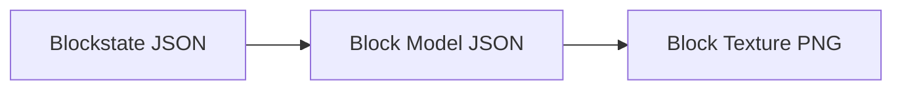
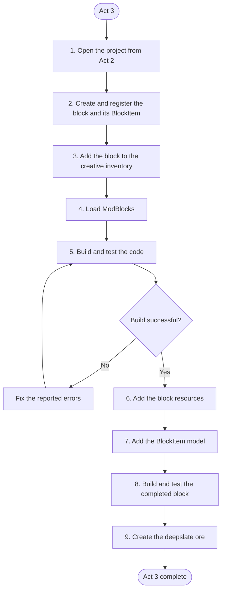

# Act 3: Block

> Act 3 uses your work from Act 2

> Learn to mod your first block, add recipies to your items, and get exposed to Minecraft's generation system!

> This is a heavy-content activity, and it is recommended to join Act 3 Activity Party.

> If you feel stuck, it is recommended to reach out for help in GC or Discord. You can also make good use of your search engine!

## Objective & Introduction

You will know how to create two new blocks, one **Stone Ore Block** and **Deepslate Ore Block** for your Raw Ore in Act 2. This is also preparing for Act 4.

Specifically, you will create 2 **Block** and their corresponding **BlockItem** (you will understand what this is).

Thanks to Rosa, we will use her art resource "Ice Cream Resource Pack", `act3_01.png` and `act3_02.png` for this activity. They are textures of **Ice Cream Ore** and **Deepslate Ice Cream Ore**!

{ .pixel-art width="150" }
{ .pixel-art width="150" }

> [Download the art resource](../assets/resource/Ice_Cream_Resource_Pack.zip)

> The art resources are only for club guide and play use. If you want to use them for other purposes, you should check out [Club Artist Contributions](../06-credits/02-club-artist-contributions.md) for specifc permissions of each author.

You can also create your own, which is recommended if you want your final product to become a personal comprehensive mod! Read the Art Resource Requirement for Act 2 below.

## Art Resource Requirement

You should prepare two textures:

- One side for your Ore Block (Stone), like Minecraft's Iron Ore Block. 
- One side for your Deepslate Ore Block (Deepslate), like Minecraft's Deepslate Iron Ore Block. 

Must be at least `16 x 16` **Pixel Grid** size, with **Transparent Background**. You can increase the resolution by 2 each time. Acceptable resolutions are: `16x16`, `32x32`, `64x64`, `128x128`, etc. We recommend `16x16` for Act 3.

Must be a **PNG** file.

## 1. Setup

> Make sure you have followed all instructions in [Template Mod Generator](../02-setup/04-template-mod-generator.md) to set up properly in IntelliJ.

> Complete Act 2 first!

!!!task
    Open your project folder for Act 2 in IntelliJ.

Below are some general tips for you!

It is recommended to do so at the beginning of Mod Development.

!!!tip
    Have a separate piece of paper out (or a doc opened), and write your mod's info on it, including your **Mod Name, Mod ID, and Package Name**. This would greatly help you recognize code later in complex structures.

!!!tip
    Have a separate piece of paper out (or a doc opened), and write your mod's items/blocks info on it when you code them, such as the `ITEM_NAME`, `item_path`, `mod-id:item_path`, etc.

## 2. Create a Block

### Organizer Class

Remember that we have `ModItems` which is the organizer class for items, we now need a new one for blocks.

!!!task "Create **ModBlocks**"
    Under `src/main/java/modpackagename/`, create a new java file named `ModBlocks`. You can select *Java Class* when creating, as it would automaticallty generate the **package declaration** and **top-level class structure**, else you would have to manually do that.

    Remember to manually add package declaration and top-level class structure if you don't use the shortcut:

    ```java
    package <mod.package.name>;

    public class ModBlocks {
    }
    ```

### Import Classes 01

Again, we need the tools first.

We want the block to be registered in the Inventory and the Registries, so that is 4 imports needed:

```java
import net.minecraft.registry.Registries;
import net.minecraft.registry.Registry;
import net.fabricmc.fabric.api.itemgroup.v1.ItemGroupEvents;
import net.minecraft.item.ItemGroups;
```

Minecraft blocks has two main components:

* The block being placed
* The block item in your inventory

This block item is a special type of object. It is still an item that needs to be registered to `Registries.ITEM`. Moreover, its constructor takes in **2 arguments** :

* a **Block** object - which block it should represent
* an **Item.Settings** object - basic settings for an item

So, 3 classes needed:
```java
import net.minecraft.item.Item;
import net.minecraft.block.Block;
import net.minecraft.item.BlockItem;
```

The Block Constructor also needs an argument --- a setting object like `Item.Settings()` to configure a block(hardness, strength, sound, etc.). Unfortunately, this is not in the `Block` class. So, we need this class:

```java
import net.minecraft.block.AbstractBlock;
```

Since we are creating an **Ore Block**, we can use the existing block settings in Minecraft to configure a block. To access them, we need another class:
```java
import net.minecraft.block.Blocks;
```

Lastly, the `Identifier` class is needed here. You might notice that your entry-point class contains this import. You would find out the reason why we need it later:
```java
import net.minecraft.util.Identifier;
```

!!!task "Import all the classes"
    Import all 10 classes below:
    ```java
    import net.minecraft.item.Item;
    import net.minecraft.block.AbstractBlock;
    import net.minecraft.block.Block;
    import net.minecraft.block.Blocks;
    import net.minecraft.item.BlockItem;

    import net.minecraft.registry.Registries;
    import net.minecraft.registry.Registry;
    import net.fabricmc.fabric.api.itemgroup.v1.ItemGroupEvents;
    import net.minecraft.item.ItemGroups;

    import net.minecraft.util.Identifier;
    ```

You should have a structure similar to mine:
```java
package com.ygledc.icecream;

import net.minecraft.item.Item;
import net.minecraft.block.AbstractBlock;
import net.minecraft.block.Block;
import net.minecraft.block.Blocks;
import net.minecraft.item.BlockItem;

import net.minecraft.registry.Registries;
import net.minecraft.registry.Registry;
import net.fabricmc.fabric.api.itemgroup.v1.ItemGroupEvents;
import net.minecraft.item.ItemGroups;

import net.minecraft.util.Identifier;

public class ModBlocks {
}
```

### Create Register method

Recall what our `register` method in `ModItems` looks like. Here is mine:
```java
private static Item register(String name, Item item){
    return Registry.register(Registries.ITEM, IceCream.id(name), item);
}
```

`Registry.register` takes in 3 arguments:

* a static field such as `Registries.ITEM`
* an `Identifier` object, which is created by using `id` method from your entry-point class
* the object such as `Item`, `Block`, etc.

However, the register method for a block is more complicated, since we have two components: `Block` and `BlockItem`. Therefore, we need to register both of them.

But you usually don't need to reference your `BlockItem` later, so we don't need to create a static field for `BlockItem`. We can register it in our `register` method, and only return the registered `Block` item.

Let's have a look at my code first:
```java
private static Block register(String name, Block block)
    {
        Identifier id = IceCream.id(name);

        Block registeredBlock = Registry.register(
                Registries.BLOCK,
                id,
                block);

        Registry.register(
                Registries.ITEM,
                id,
                new BlockItem(registeredBlock, new Item.Settings())
        );

        return registeredBlock;
    }
```

You should be able to identify 2 uses of `Registry.register` that registers the `Block` and the `BlockItem`. Also, I inistantiate the `BlockItem` object within this `register` method, because again, we usually don't need to reference to it later.

Some big differences are:

* I store my `Identifier` object `IceCream.id(name)` in a method's local variable named `id`. Therefore, I can refer to it later in the 2 `Registry.register`, without calling `IceCream.id(name)` again. 
> in `IceCream.id(name)`, `name` is the paramter that accepts the `block_path` (since we are creating a block) passed in, which is a String. `IceCream` is my entry-point class.

    > Here is the reason why we need to **import** `Identifier`. We create a local variable that is an `Identifier` data type, so we need the `Identifier` class.

* I store the registered Block object in a variable called `registeredBlock`. Why? Because remember that the constructor of `BlockItem` needs an `Block` object as argument, thus, we pass it is.

* At last, we return `registeredBlock`, which refers to our registered Block object.

!!!task "Create your `register` method"
    Create your `register` method for `ModBlocks` with the following template:
    ```java
    private static Block register(String name, Block block)
        {
            Identifier id = <EntryPointClass>.id(name);

            Block registeredBlock = Registry.register(
                    Registries.BLOCK,
                    id,
                    block);

            //Uses Registries.BLOCK for Block

            Registry.register(
                    Registries.ITEM,
                    id,
                    new BlockItem(registeredBlock, new Item.Settings())
            );

            //Uses Registries.ITEM for BlockItem

            return registeredBlock;
        }
    ```

### Instantiation

Now, we need to instantate the block and create its static field using our `register` method. But we don't use `Item.Settings` this time. Instead, we use `AbstractBlock.Settings`.

However, its constructor is used differently. You normally create a `AbstractBlock.Settiings` object by using its `create` method or `copy` method:
```java
new AbstractBlock.Settings.create()
new AbstractBlock.Settings.copy(Blocks.STONE) //copy the setting of an existing block
```

I would like my Ice Cream Ore to have the same settings as an **Iron Ore**, so I do:
```java
new AbstractBlock.Settings.copy(Blocks.IRON_ORE)
```
Then you will follow the normal procedure of instantiating the object and assigning it to a variable, which is the static field (attribute of class).

!!!task "Create your block"
    Create your block following the template for a `Block`, copying settings of Iron Ore:
        ```java
        public static final Block <BLOCK_VAR_NAME> = register(<String block_path>,
                new Block(AbstractBlock.Settings.copy(Blocks.IRON_ORE)));

            //you can copy another block if you want
            //however, your block's configuration would also change as well
        ```

### Initialize Method

Lastlt, we need to register our `Block` to the inventory, specifically, the **Natural** tab because this is an ore.

> Why not register BlockItem to Inventory?

> After registering the Block to the Inventory, Minecraft will show the corresponding item form for that block in the Inventory, which is its BlockItem.

Remember that we accomplish this by creating the `initialize` method that follows this format:
```java
public static void initialize() {
        ItemGroupEvents.modifyEntriesEvent(ItemGroups.<TAB>)
                .register(entries -> {
                    entries.add(<VAR_NAME>);
                    entries.add(<VAR_NAME>);
                    ...
                });
    }
```

!!!task "Register to Inventory by creating `initialize`"
    Register your `Block` to the Natural tab of Inventory by creating:
    ```java
    public static void initialize() {
        ItemGroupEvents.modifyEntriesEvent(ItemGroups.NATURAL)
                .register(entries -> {
                    entries.add(<BLOCK_VAR_NAME>);
                });
    }
    ```

Now, you should have something similar to mine in `ModBlocks`:
```java
package com.ygledc.icecream;

import net.minecraft.item.Item;
import net.minecraft.block.AbstractBlock;
import net.minecraft.block.Block;
import net.minecraft.block.Blocks;
import net.minecraft.item.BlockItem;

import net.minecraft.registry.Registries;
import net.minecraft.registry.Registry;
import net.fabricmc.fabric.api.itemgroup.v1.ItemGroupEvents;
import net.minecraft.item.ItemGroups;

import net.minecraft.util.Identifier; //Identifier type

public class ModBlocks {

    public static final Block ICE_CREAM_ORE = register("ice_cream_ore",
            new Block(AbstractBlock.Settings.copy(Blocks.IRON_ORE)));


    private static Block register(String name, Block block) {
        Identifier id = IceCream.id(name);

        Block registeredBlock = Registry.register(
                Registries.BLOCK,
                id,
                block);

        Registry.register(
                Registries.ITEM,
                id,
                new BlockItem(registeredBlock, new Item.Settings())
        );

        return registeredBlock;
    }

    public static void initialize() {
        ItemGroupEvents.modifyEntriesEvent(ItemGroups.NATURAL)
                .register(entries -> {
                    entries.add(ICE_CREAM_ORE);
                });
    }
}
```

## 3. Load ModBlocks

We need to load `ModBlocks` in our entry-point class, just like what we did for `ModItems` by using the `initialize` method we created.

!!!task "Load ModBlocks"
    Go to your entry-point class, and find where `onInitialize` is, and add `ModBlocks.initialize()`. This is how yours should look:

    ```java
    public void onInitialize() {
            // This code runs as soon as Minecraft is in a mod-load-ready state.
            // However, some things (like resources) may still be uninitialized.
            // Proceed with mild caution.

            ModItems.initialize();
            ModBlocks.initialize();

            LOGGER.info("Hello Fabric world!");
        }
    ```
    > Don't forget the semicolon!

## 4. Checkpoint and Test 01

Make sure you've completed all code before!

Do the same checkpoint process!

From now on, only commands and expectations of testing would be mentioned. If you forget the exact process, reference Act 1 and 2, or see Dictionary.

!!!task "Build and Run"
    Below are commands you need to use:

    ```txt
    ./gradlew build
    ```
    ```txt
    ./gradlew runClient
    ```

You should be able to see your block but in a black-and-purple missing texture pattern, since we haven't add any resources.

## 5. Add Resources for Block

For a basic block, different than a basic item, you need **4** resources.

### Lang JSON
Find your `en_us.json` under `src/main/resources/assets/mod-id/lang/`, and add a new JSON object for your **Block**:
```json
"block.<mod-id>.<block_path>": "<Block Displayed Name>"
```

You should have something similar:
```json
{
  "item.ice-cream.ice_cream_ingot": "Ice Cream Ingot",
  "item.ice-cream.raw_ice_cream": "Raw Ice Cream",
  "item.ice-cream.ice_cream_burnt": "Ice Cream Burnt",
  "block.ice-cream.ice_cream_ore": "Ice Cream Ore"
}
```

### Models JSON

!!!task "Create `block` directory"
    Create another directory named `block` under your `.../mod-id/models/`, same level as the `item` directory.

!!!task "Create JSON"
    Create the JSON file for your Block in `block`, following the rules:
    ```txt
    <block_path>.json
    ```
!!!task "Write JSON"
    Inside your JSON, write your JSON code for your Block's model:

    ```json
    {
        "parent": "minecraft:block/cube_all",
        "textures": {
            "all": "<mod-id>:block/<block_path>"
        }
    }
    ```


What do some components mean:

* `"parent"` : the key; tells Minecraft which model this block's model is based on
* `"minecraft:block/cube_all"`: the value; says to use Minecraft’s standard cube model where all 6 faces use the same texture
* `"textures"` : the key; tells Minecraft what texture you want to apply to the model
* `"all"` : the key; matches `cube_all`, meaning all 6 faces of the block uses the texture represented by `"<mod-id>:block/<block_path>"`
* `"<mod-id>:block/<block_path>"` : the value; tells Minecraft which block you are applying the texture to, and the texture (png file) is located in `src/main/resources/assets/mod-id/textures/block/`
> We will create the `textures/block` directory level later!

My example model JSON:
```json
{
  "parent": "minecraft:block/cube_all",
  "textures": {
    "all": "ice-cream:block/ice_cream_ore"
  }
}
```

### Textures PNG
!!!task "Create `block` directory in `textures`"
    Create a new directory named `block` under `.../mod-id/textures/`, the same level where `item` is.

!!!task "Add and name your texture"
    Add your texture png for your ore block to `block`, and rename it following the naming rules:
    ```txt
    <block_path>.png
    ```

> The guide uses `act3_01.png` in Rosa's Ice Cream Resource Pack
### Blockstates JSON

**Blockstates** JSON tells Minecraft which block model to use for each state of a block.

For example, a furnace has different states, like `facing=north` and `lit=false`.

This JSON chooses which model JSON to use, which refers to its corresponding texture. Here is a simple visualization of relationship:


!!!task "Create `blockstates` directory"
    Create a new directory named `blockstates` under `src/main/resources/assets/mod-id/`, the same level where `lang`, `models`, and `textures` are.

    > Remember to INCLUDE the `s`!

!!!task "Create JSON"
    Create a new JSON file named `<block_path>.json` in your `blockstates` directory.

!!!task "Write JSON"
    Inside your JSON, write the JSON code for your block's blockstate:
    ```json
    {
        "variants": {
            "": {
            "model": "<mod-id>:block/<block_path>"
            }
        }
    }
    ```

What do some components mean:

* `"variants"` : the key; lists the possible block states and which model each state should use.
* `""` : the key; empty state condition. This means the default state, with NO special properties like facing or lit.
* `"model"` : the key; tells Minecraft which block **Models JSON** to use.
* `"<mod-id>:block/<block_path>"` : the value; represents your **Model JSON** for the block

My example:
```json
{
  "variants": {
    "": {
      "model": "ice_cream:block/ice_cream_ore"
    }
  }
}
```

## 6. Add Resources for BlockItem

Remember the `BlockItem` that we register? It also needs a model to show in the inventory. Else, you will find out that despite the Block could be successfully placed, it is shows a missing texture pattern in your inventory.

Therefore, we add a **Model JSON** for our `BlockItem`. 

Because it is still an **Item**, you would add its JSON under ".../models/item/".

!!!task "Add JSON"
    Inside `.../models/item/`, add a new JSON file named `<block_path>.json`.

!!!task "Write JSON"
    Inside that JSON, write:
    ```json
    {
        "parent": "<mod-id>:block/<block_path>"
    }
    ```

Recall what `"parent"` mean here: it tells Minecraft which model this item's model is based on.

Our value is `"<mod-id>:block/<block_path>"`, which refers to the **Model JSON** of our `Block`, which is the JSON `.../models/block/block_path.json` that you created before.

That is how you see a 3d model of block when you are holding it in your inventory!

## 7. Checkpoint and Test 02

Make sure you've completed all code before!

Do the same checkpoint process!

From now on, only commands and expectations of testing would be mentioned. If you forget the exact process, reference Act 1 and 2, or see Dictionary.

!!!task "Build and Run"
    Below are commands you need to use:

    ```txt
    ./gradlew build
    ```
    ```txt
    ./gradlew runClient
    ```

You should be able to find your Block with complete model and texture of BlockItem. You should also place your Block to see if its model and texture are completed.

If you try to mine it with a pickaxe in survival mode, you'll notice it takes a long time, and it drops nothing. We will add these features in Act 4.

## 8. Do Deepslate Ore!

Now, try to create your **Deepslate Ore** by following the steps above! You don't have to repeat all steps.

Below is the general workflow:

* Create a static field for your Deepslate Ore and register it to `Registries.BLOCK` using `register`, which also helps register its BlockItem at the same time.
* Register your Deepslate Ore to Inventory (`ItemGroups.NATURAL`) by adding a new line of code in `initialize`
* Add resources for Deepslate Ore: **Lang JSON, Models JSON, Textures PNG, Blockstates JSON**
* Add resources for Deepslate Ore's BlockItem: **Models JSON**
* Make a checkpoint and test if it works!

## Mermaid Workflow

A mermaid visualization for the general workflow.

---

Nice!

That is all for Act 3.

You can check [Dictionary](../04-dictionary/index.md) to search and review for any important concepts or definitions.

!!! warning
    Do NOT delete your work for Act 3. Activities are designed to develop a full mod with multiple elements, so most activities in the future are based on the previous one.

    It is recommended to make a copy as backup, and one way is to use GitHub.


