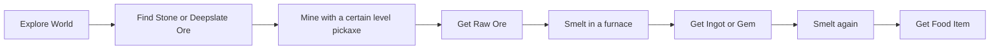
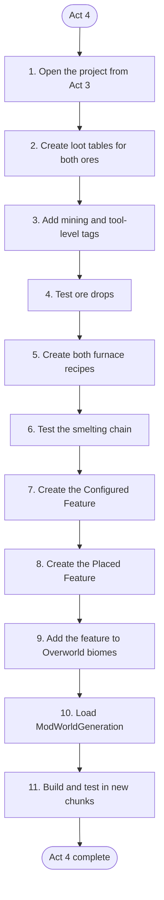

# Act 4: World Gen, Loot Tables & Recipes

> Act 4 uses your work from Act 3.

> Learn to make your ores drop Raw Ore, smelt your items in a furnace, and generate both Stone and Deepslate Ore underground!

> This is probably the hardest activity among Act 1 -> Act 4. It is recommended to attend the Act 4 Party or watch recordings.

> Do not try to memorize each detail and meaning! Those explanations should help you understand what we are doing and why; in development, you can always refer back to them if you forget

> If you feel stuck, it is recommended to reach out for help in GC or Discord. You can also make good use of your search engine!

## Objective & Introduction

In Act 3, you created a **Stone Ore Block** and a **Deepslate Ore Block**. They look nice, but they do not yet complete the ore adventure. If you mine them, they may drop nothing, and you can only find them by taking them from the Creative Inventory.

We will fix that in this activity!

By the end of Act 4, your mod will follow this complete journey:



In this activity, we will work mostly with **data files**, which are JSON files that tell Minecraft what should happen (in the server side). We will also use a small Java organizer class to add our ore generation to the Overworld.

## Art Resource Requirement

There's no art resource needed for Act 4.

## 1. Setup

> Make sure you have followed all instructions in [Template Mod Generator](../02-setup/04-template-mod-generator.md) to set up properly in IntelliJ.

> Complete Act 3 first!

!!!task
    Open your project folder from Act 3 in IntelliJ.

Below are some general tips for you!

It is recommended to do so at the beginning of Mod Development.

!!!tip
    Have a separate piece of paper out (or a doc opened), and write your mod's info on it, including your **Mod Name, Mod ID, and Package Name**. This would greatly help you recognize code later in complex structures.

!!!tip
    Have a separate piece of paper out (or a doc opened), and write your mod's items/blocks info on it when you code them, such as the `ITEM_NAME`, `item_path`, `mod-id:item_path`, etc.


!!!warning "Minecraft 1.21.1 folder names"
    In Minecraft 1.21.1, some data folders use a **singular** name. We will use `loot_table` and `recipe`, not `loot_tables` and `recipes`.

## 2. Understand Data Files

Recall that your textures and models are placed under `src/main/resources/assets/<mod-id>/`. Those files mainly control how your mod looks and sounds.

The files in this activity go under `src/main/resources/data/<mod-id>/` (you will create this structure later). They mainly control how the game behaves.

After this activity, the new part of your resource structure will look similar to mine:

```text
src/main/resources/
└── data/
    ├── ice-cream/
    │   ├── loot_table/
    │   │   └── blocks/
    │   │       ├── ice_cream_ore.json
    │   │       └── deepslate_ice_cream_ore.json
    │   ├── recipe/
    │   │   ├── ice_cream_ingot_from_smelting_raw_ice_cream.json
    │   │   └── ice_cream_burnt_from_smelting_ice_cream_ingot.json
    │   └── worldgen/
    │       ├── configured_feature/
    │       │   └── deepslate_and_ice_cream_ore.json
    │       └── placed_feature/
    │           └── deepslate_and_ice_cream_ore.json
    └── minecraft/
        └── tags/
            └── block/
                ├── mineable/
                │   └── pickaxe.json
                └── needs_iron_tool.json
```

## 3. Loot Tables: Block Drop Item

A **Loot Table** tells Minecraft what items can appear after an action. Minecraft uses loot tables for many things, including breaking blocks, opening generated chests, fishing, and defeating entities.

We will create loot tables for our two blocks that accomplish the following:

* If the player uses **Silk Touch**, drop the Ore Block itself.
* Otherwise, drop the **Raw Ore**.
* If the tool has **Fortune**, allow Minecraft's normal ore Fortune behavior.
* If an explosion destroys the block, apply Minecraft's normal explosion drop reduction.

### Loot Table JSON 01

!!!task "Create the loot table directory levels"
    Under `src/main/resources/`, create this directory structure:

    ```text
    data/<mod-id>/loot_table/blocks/
    ```

!!!task "Create the Stone Ore loot table"
    Inside `blocks`, create a JSON file named after your Stone Ore's path:

    ```text
    <stone_ore_path>.json
    ```

For my mod, the file is `ice_cream_ore.json`.

### Build the Loot Table Step by Step

The complete ore loot table is long because it supports Silk Touch, Fortune, and explosions. Instead of copying all of it without knowing why, we will start with the smallest useful loot table and add one behavior at a time.

!!!concept "Data Generation"
    Why are we writing JSON instead of Java?

    Minecraft reads loot tables as JSON data. Fabric's **Data Generation** (you've already checked its box when generating templates for Act 1) lets mod developers write Java that generates these JSON files.
    
    In this activity, we write the JSON manually so you can see and understand the actual loot-table structure first.

#### Step 1: The Root of the Loot Table

!!!task
	Begin with this outer structure:

```json
{
  "type": "minecraft:block",
  "pools": []
}
```

* `type` : tells Minecraft what kind of situation uses this table. `minecraft:block` means this loot table belongs to a broken block.
* `pools` : a JSON array containing groups of possible drops. The brackets `[]` mean that it can hold more than one pool.
> JSON arrays are like lists that holds many elements


Right now, `pools` is empty, so this table cannot drop anything.

#### Step 2: Add a Loot Pool

A **pool** represents one group of possible results.

!!!task
	Add one object inside the `pools` array:

```json
{
  "type": "minecraft:block",
  "pools": [
    {
      "rolls": 1.0,
      "bonus_rolls": 0.0,
      "entries": []
    }
  ]
}
```

* `rolls` : how many times Minecraft chooses from this pool. `1.0` means one choice.
* `bonus_rolls` : can add extra choices depending on the player's luck. We do not want general Luck to change for ore mining, so this is `0.0`. Actually, it is already default to `0.0`, so omitting this line would be fine if you want.
* `entries` : the array of possible things this pool can choose, meaning it could contain multiple JSON objects.

The pool now rolls once, but `entries` is still empty. We need to tell it what item it can choose.

#### Step 3: Add the Raw Ore Entry

An **entry** describes a possible result.

!!!task
	Add an item entry inside `entries`:

```json
{
  "type": "minecraft:block",
  "pools": [
    {
      "rolls": 1.0,
      "bonus_rolls": 0.0,
      "entries": [
        {
          "type": "minecraft:item",
          "name": "<mod-id>:<raw_ore_item_path>"
        }
      ]
    }
  ]
}
```

Inside the entry:

* `"type": "minecraft:item"` : means the result is an item.
* `name` : the key; tells us that the value should be the complete ID of the item to drop.

!!!concept "Item ID"
	Recall that any mod Item/Block/... has an ID that follows:
	```txt
	<mod-id>:<item_path>
	```

	Similar to Minecraft's items:
	```txt
	minecraft:iron_ingot
	```

My item entry is:

```json
{
  "type": "minecraft:item",
  "name": "ice-cream:raw_ice_cream"
}
```
> This JSON object is considered as one entry, which is our basic Raw Ore entry. Remember this information! We will replace this entry later with something else...

At this point, the loot table already works! Mining the block with a valid tool will drop one Raw Ore. The remaining structure adds special behavior.

#### Step 4: Understand Conditions and Functions

Know some important tools can be attached to loot-table objects by **keys**:

| Tool | What it does | Example |
| --- | --- | --- |
| `conditions` | Should this entry or pool be used? | Only use this entry when the tool has XXXX (e.g., Silk Touch) |
| `predicate` | Usually used after conditions such as `"conditions": "minecraft:match_tool"`, so that you can use `predicates` | A must-need syntax rule for some conditions |
| `predicates` | Checks whether something matches a set of requirements | describes the requirements that the tool must match to mine an ore |

==A **condition** can prevent an entry from being selected. A **(predicate)predicates** checks whether something matches a sets of requirements.==

This distinction helps when you invent your own drops later:

```text
Condition: Should this happen?
Predicate : A syntax rule to use predicates.
Predicates: The **sets of conditions** to met.
```

Relationship between Predicate and Predicates:
```txt
predicate = one complete item/tool/... test
└── predicates = collection of component tests
```

Example of relationship:
```json
"predicate": {
  "predicates": {
    "minecraft:enchantments": [...]
  }
}
```

!!!concept "Condition Arrays"
	Condition arrays use **AND** logic, which means all conditions, including all predicates inside, should all be TRUE! If one is false, then Minecraft stops reading and outputs the final result. 
	```json
	"conditions": [
		conditionA,
		conditionB,
		conditionC
		]
	```

!!!concept "JSON Indentation"
	JSON indentation helps you see which JSON objects belong inside which JSON arrays. If you add a condition or function at the wrong level, Minecraft may reject the file or apply it to a different part of the table.

#### Step 5: Add Silk Touch with Alternatives

In Minecraft, Silk Touch creates two possible paths:

1. If the tool has Silk Touch, drop the Ore Block.
2. Otherwise, drop the Raw Ore.

!!!task
	For an ordered choice like this, replace our **basic Raw Ore entry** (Not the whole code) with a `minecraft:alternatives` entry:
	> Don't worry about the long JSON below, we will explain it later.

```json
{
  "type": "minecraft:alternatives",
  "children": [
    {
      "type": "minecraft:item",
      "conditions": [
        {
          "condition": "minecraft:match_tool",
          "predicate": {
            "predicates": {
              "minecraft:enchantments": [
                {
                  "enchantments": "minecraft:silk_touch",
                  "levels": {
                    "min": 1
                  }
                }
              ]
            }
          }
        }
      ],
      "name": "<mod-id>:<stone_ore_path>"
    },
    {
      "type": "minecraft:item",
      "name": "<mod-id>:<raw_ore_path>"
    }
  ]
}
```

* `minecraft:alternatives` checks its `children` from top to bottom, and selects the first **child** that generates a result.
* `children` usually contains a JSON array with conditions that need to be checked. Each object enclosed by `{}` in it is a **child**.
> For example, our above `children` has 2 **child**, one represents silk touch drop and one represents normal raw ore drop.
* `minecraft:match_tool` checks the tool used to break the block.
* keys like `"minecraft:enchantments"`, `"enchantments"`, `"levels"`, `"min"` are literal meanings. 
> `min` means the minimum level enchantment level required; `1` means the first enchantment level, `0` represents absence.
* The enchantment predicate requires at least level 1 of Silk Touch.
* If that condition passes, Minecraft selects the Ore Block entry and stops checking, which drops the ore block itself.
* If it fails, Minecraft moves to the Raw Ore entry, which drops the raw ore item.

Order matters! If the unconditional Raw Ore entry came first, it would always match, and Minecraft would never reach the Silk Touch entry.

The above JSON entry has 3 main entries:

* Alternative Entry - Defines a checking order from top to bottom:
```json
{
	"type": "minecraft:alternatives",
		"children":[...<Many Child>...]
}
```

* Silk Touch Entry - The conditions to reach a silk touch drop, which drops the ore block:
```json
{
	"type": "minecraft:item",
	"conditions": [...],
	"name": "<mod-id>:<stone_ore_path>"
}
```

* **Raw Ore Entry** - The "else" result if silk touch conditions are not met, which is the raw ore item drop:
```json
{
	"type": "minecraft:item",
	"name": "<mod-id>:<raw_ore_path>"
}
```
> We will modify this later

They are called **entries** because they are actual entries in `"entries"`:
```json
{
  "type": "minecraft:block",
  "pools": [
    {
      "rolls": 1.0,
      "bonus_rolls": 0.0,
      "entries": [
        {
          <Your Entries>
        }
      ]
    }
  ]
}
```

> This part is hard to understand. Try analyzing each `conditions`, `predicate`, and `predicates`, and you will find an order. This is like nested if-else statement.

> If you need help understanding, attend the Act 4 Party or watch the recordings for this part.

#### Step 6: Add Fortune and Explosion Functions

We've completed the condition check for silk touch. Now, if silk touch is False, that means Minecraft reads the Raw Ore entry. For a mining action without silk touch, we also want to mention **fortune**, else your Block wouldn't drop any bonus when mining with fortune.

We simply use `functions` to accomplish that. We don't use `conditions` or `predicates` because there is no need for a condition check after exiting Silk Touch's condition check. We know that there is no silk touch, so the drop must be a Raw Ore. How do we want to modify this drop? Then we will use something called `functions`.

| Tool | What it does | Example |
| --- | --- | --- |
| `functions` | How should the selected result be changed?(contains multiple `function`) | Increase the amount using Fortune, Using XXX, etc. |
| `function` | Identifies one particular operation/modification | Increase the amount using Fortune |


Relationship:
```txt
functions = collection
└── function = identity of each operation
```
Example of relationship:
```json
"functions": [
  {
    "function": "<OPERATION_1>"
  },
  {
    "function": "<OPERATION_2>"
  }
]
```

!!!task
	Add a `functions` array to the **Raw Ore entry**:

```json
{
  "type": "minecraft:item",
  "functions": [
    {
		"function": "minecraft:apply_bonus",
    	"enchantment": "minecraft:fortune",
		"formula": "minecraft:ore_drops"
    },
    {
      "function": "minecraft:explosion_decay"
    }
  ],
  "name": "<mod-id>:<raw_ore_path>"
}
```

The functions run in array order:

* `"function": "minecraft:apply_bonus"` : the function; modifies the count according to an enchantment. This function requires `enchantment` and `formula` to work.
* `"enchantment": "minecraft:fortune"` : selects Fortune.
* `"formula": "minecraft:ore_drops"` : uses Minecraft's normal ore-drop formula.
* `"function": "minecraft:explosion_decay"` : the second function; gives each resulting item a chance to be lost when an explosion breaks the block. It doesn't require extra configuration like `apply_bonus`.

These functions belong only to the Raw Ore entry. Silk Touch should drop one Ore Block, so we do not add the Fortune function to the Silk Touch entry.

> Just in case if you are interested, using `conditions` and `predicates` instead of `functions` and `function` would be like this, which is redundant:
```json
{
  "function": "minecraft:apply_bonus",
  "enchantment": "minecraft:fortune",
  "formula": "minecraft:ore_drops",
  "conditions": [
    {
      "condition": "minecraft:match_tool",
      "predicate": {
        "predicates": {
          "minecraft:enchantments": [
            {
              "enchantments": "minecraft:fortune",
              "levels": {
                "min": 1
              }
            }
          ]
        }
      }
    }
  ]
}
```
> THIS IS ONLY FOR SHOWING HOW IT LOOKS WITH CONDITION CHECK!

#### Step 7: The Complete Stone Ore Loot Table

Now put the pieces together:

```json
{
  "type": "minecraft:block",
  "random_sequence": "<mod-id>:blocks/<stone_ore_path>",
  "pools": [
    {
      "bonus_rolls": 0.0,
      "entries": [
        {
          "type": "minecraft:alternatives",
          "children": [
            {
              "type": "minecraft:item",
              "conditions": [
                {
                  "condition": "minecraft:match_tool",
                  "predicate": {
                    "predicates": {
                      "minecraft:enchantments": [
                        {
                          "enchantments": "minecraft:silk_touch",
                          "levels": {
                            "min": 1
                          }
                        }
                      ]
                    }
                  }
                }
              ],
              "name": "<mod-id>:<stone_ore_path>"
            },
            {
              "type": "minecraft:item",
              "functions": [
                {
                  "enchantment": "minecraft:fortune",
                  "formula": "minecraft:ore_drops",
                  "function": "minecraft:apply_bonus"
                },
                {
                  "function": "minecraft:explosion_decay"
                }
              ],
              "name": "<mod-id>:<raw_ore_path>"
            }
          ]
        }
      ],
      "rolls": 1.0
    }
  ]
}
```
You might notice something additional here: `random_sequence`. It is **optional** to add. Here is an explanation of what it is:

`"random_sequence": "<mod-id>:blocks/<stone_ore_path>"` applies a specific name related with this block's loot table for **random results**. It doesn't point to any path. 

**Random Results:** Imagine Minecraft has a defualt 6-sided die. When you mine a block with Fortune, it **might** give you bonus drops. Minecraft determines the result by rolling the die. This is a random result. `random_sequence` gives the source of random results—the “die” used by this loot table—a unique name. What can that do? You can then use a different "die" for the random events of this loot table, for example, a "5-sided die".
> However, for normal loot tables, random_sequence is never mandatory. Minecraft can generate random results without it.

For my Ice Cream Ore, I replace the placeholders with:

| Placeholder | My value |
| --- | --- |
| `<mod-id>` | `ice-cream` |
| `<stone_ore_path>` | `ice_cream_ore` |
| `<raw_ore_path>` | `raw_ice_cream` |

### How to Add More Loot Behavior

Once you understand the layers, you can extend a loot table without starting over:

* Add another object to `pools` when you want a separate roll, such as a rare bonus item in addition to the normal ore drop.
* Add entries when one pool should choose among multiple possible results.
* Add `conditions` to a pool or entry to limit when it is allowed.
* Add `functions` to change an item's count, copy data, apply an enchantment bonus, or handle explosions.
* Use `minecraft:alternatives` when Minecraft should use the first child whose conditions pass.

For example, this second pool gives a one-in-ten chance to drop a Diamond in addition to the normal pool:

```json
{
  "rolls": 1.0,
  "bonus_rolls": 0.0,
  "entries": [
    {
      "type": "minecraft:item",
      "conditions": [
        {
          "condition": "minecraft:random_chance",
          "chance": 0.1
        }
      ],
      "name": "minecraft:diamond"
    }
  ]
}
```

This object would be added after the first pool inside the outer `pools` array. `0.1` means a 10% chance. This is only an experiment—your project does not need to drop Diamonds!

Mine with this extra pool:
```json
{
  "type": "minecraft:block",
  "random_sequence": "ice-cream:blocks/ice_cream_ore",
  "pools": [
    {
      "rolls": 1.0,
      "bonus_rolls": 0.0,
      "entries": [
        {
          "type": "minecraft:alternatives",
          "children": [
            {
              "type": "minecraft:item",
              "conditions": [
                {
                  "condition": "minecraft:match_tool",
                  "predicate": {
                    "predicates": {
                      "minecraft:enchantments": [
                        {
                          "enchantments": "minecraft:silk_touch",
                          "levels": {
                            "min": 1
                          }
                        }
                      ]
                    }
                  }
                }
              ],
              "name": "ice-cream:ice_cream_ore"
            },
            {
              "type": "minecraft:item",
              "functions": [
                {
                  "function": "minecraft:apply_bonus",
                  "enchantment": "minecraft:fortune",
                  "formula": "minecraft:ore_drops"
                },
                {
                  "function": "minecraft:explosion_decay"
                }
              ],
              "name": "ice-cream:raw_ice_cream"
            }
          ]
        }
      ]
    },

    {
      "rolls": 1.0,
      "entries": [
        {
          "type": "minecraft:item",
          "conditions": [
            {
              "condition": "minecraft:random_chance",
              "chance": 0.1
            }
          ],
          "name": "minecraft:diamond"
        }
      ]
    }
  ]
}
```
> `,` plays an important role in JSON

!!!tip
    When adding something new, change one layer at a time and test it. Minecraft's own loot tables are also useful examples because they use the same pool, entry, condition, and function structure.

### Create the Deepslate Ore Loot Table

The Deepslate Ore uses the same general loot table. Only the Ore Block ID and the `random_sequence` need to use your Deepslate Ore path. It should still drop the same Raw Ore.

!!!task "Create the Deepslate Ore loot table"
    In the same `loot_table/blocks` directory, create:

    ```text
    <deepslate_ore_path>.json
    ```

    Copy your Stone Ore loot table, then change all occurrences of `<stone_ore_path>` to `<deepslate_ore_path>`.

For my mod, I copy `ice_cream_ore.json` to `deepslate_ice_cream_ore.json`. Then I change:

```json
"name": "ice-cream:ice_cream_ore"
```

to:

```json
"name": "ice-cream:deepslate_ice_cream_ore"
```

> These are probably the most difficult parts for JSON. Congratulations! 

### Add Mining Tool Tags

The loot table decides **what** drops, but block tags help decide **how** the block can be mined.

We want our ores to be mineable with a pickaxe. For this demonstration, we will also require an Iron Pickaxe or a better tool. You can choose a different tool level for your own ore.

!!!task "Create the pickaxe tag"
    Create the following directory level and json file:

    ```text
    src/main/resources/data/minecraft/tags/block/mineable/pickaxe.json
    ```

    Write:

    ```json
    {
      "replace": false,
      "values": [
        "<mod-id>:<stone_ore_path>",
        "<mod-id>:<deepslate_ore_path>"
      ]
    }
    ```

Why create this directory level:
```txt
src/main/resources
└── data                      Server-side game data
    └── minecraft             Minecraft (namespace) owns the tag
        └── tags              This file defines a tag
            └── block         The tag contains blocks
                └── mineable
                    └── pickaxe.json
```

* Notice that this file is under `data/minecraft`, not `data/<mod-id>`. We are adding our blocks to a tag owned by Minecraft.
* Setting `"replace": false` means we add our blocks to Minecraft existing tag (`minecraft:mineable/pickaxe`) without removing Minecraft's blocks. It is like saying: We intentionally want to add this tag, not replacing it. However, ignoring this line is also fine for this activity.

!!!task "Choose a required tool level"
    To require an Iron Pickaxe or better, create:

    ```text
    src/main/resources/data/minecraft/tags/block/needs_iron_tool.json
    ```
	> you've already created `.../minecraft/tags/block/`, so you only need to add `needs_iron_tool.json` under it.

    Use the same two block IDs:

    ```json
    {
      "replace": false,
      "values": [
        "<mod-id>:<stone_ore_path>",
        "<mod-id>:<deepslate_ore_path>"
      ]
    }
    ```

My example is:

```json
{
  "replace": false,
  "values": [
    "ice-cream:ice_cream_ore",
    "ice-cream:deepslate_ice_cream_ore"
  ]
}
```

You can instead use `needs_stone_tool.json` or `needs_diamond_tool.json`, and that changes the requirement to mine.

In conclusion, we are adding our blocks to the existing block tags `minecraft:mineable/pickaxe` and `minecraft:needs_iron_tool`. Together, they tell Minecraft that:

* A pickaxe is the correct tool for mining those blocks!
* An Iron Pickaxe or better is required for the blocks to drop their items!

## 4. Checkpoint and Test 01

!!!task "Build and Run"
    Build and run your mod:

    ```txt
    ./gradlew build
    ```

    ```txt
    ./gradlew runClient
    ```

In a test world, place both Ore Blocks and switch to Survival Mode.

Test these cases:

* Mine with a tool that is too weak. It should not drop the Raw Ore.
* Mine with a valid pickaxe. It should drop the Raw Ore.
* Mine with Silk Touch. It should drop the Ore Block itself.
* Mine with Fortune. It should have a chance to drop extra Raw Ore.

!!!tip
    If the block still drops nothing, check the file path first. The loot table filenames must exactly match the registered block path.

## 5. Recipes: Smelting

A **Recipe** tells Minecraft **which inputs can create an output**. Recipes can be in Crafting Table, Furnaces, Blast Furnaces, Smokers, Stonecutters, Smithing Tables, etc.

We will create two **furnace** recipes:

1. Raw Ore → Ingot/Gem
2. Ingot/Gem → Food Item

!!!task "Create the recipe folder"
    Create a new directory named `recipe` under `.../data/<mod-id>`:

    ```text
    .../data/<mod-id>/recipe
    ```

### Raw Ore to Ingot/Gem

!!!task "Create the first smelting recipe"
    Inside `recipe`, create a JSON file with a clear and unique name, such as:

    ```text
    <ingot_path>_from_smelting_<raw_ore_path>.json
    ```

!!!task "Write JSON"
	Use this template:

```json
{
  "type": "minecraft:smelting",
  "category": "misc",
  "cookingtime": <int ticks>,
  "experience": <decimal experience>,
  "ingredient": {
    "item": "<mod-id>:<raw_ore_path>"
  },
  "result": {
    "id": "<mod-id>:<ingot_path>",
	"count": <int count>
  }
}
```

Here is what the important values mean:

* `type` selects the Furnace smelting system `"minecraft:smelting"`.
* `category` controls where the recipe is organized in the **Recipe Book**.
* `cookingtime` is measured in **ticks**. Minecraft normally runs at 20 ticks per second, so `200` ticks is about 10 seconds.
* `int ticks`: Accepts an integer like `200` that represents ticks.
* `experience` is the experience given when the result is collected.
* `decimal experience` : Accepts a decimal like `1.0` that represents experience gained.
* `ingredient` is the input.
* `item`: the ingredient should match one specific registered item
> Some recipes in Minecraft also use `tag` to let every ingredient that belongs to that tag perform the recipe
* `result` is the output.
* `id` : identifies the item `<mod-id>:<ingot_path>` that the result stack contains
* `count`: how many results you want. Default to 1 if not mentioned. You can ignore this line if you just want 1 result object.

My file is named `ice_cream_ingot_from_smelting_raw_ice_cream.json`:

```json
{
  "type": "minecraft:smelting",
  "category": "misc",
  "cookingtime": 200,
  "experience": 0.7,
  "ingredient": {
    "item": "ice-cream:raw_ice_cream"
  },
  "result": {
    "id": "ice-cream:ice_cream_ingot",
	"count": 2
  }
}
```

### Ingot/Gem to Food Item

Similar steps here.

!!!task "Create the second smelting recipe"
    Create another JSON file, such as:

    ```text
    <food_path>_from_smelting_<ingot_path>.json
    ```

Use this template:

```json
{
  "type": "minecraft:smelting",
  "category": "food",
  "cookingtime": 200,
  "experience": 0.35,
  "ingredient": {
    "item": "<mod-id>:<ingot_path>"
  },
  "result": {
    "id": "<mod-id>:<food_path>"
  }
}
```

My `ice_cream_burnt_from_smelting_ice_cream_ingot.json` is:

```json
{
  "type": "minecraft:smelting",
  "category": "food",
  "cookingtime": 200,
  "experience": 0.35,
  "ingredient": {
    "item": "ice-cream:ice_cream_ingot"
  },
  "result": {
    "id": "ice-cream:ice_cream_burnt",
	"count": 3
  }
}
```

!!!tip "Optional Blast Furnace recipe"
    A Furnace recipe does not automatically work in a Blast Furnace. If you want your Raw Ore to work there too, copy the first recipe into a new file and change `"minecraft:smelting"` to `"minecraft:blasting"`.

## 6. Checkpoint and Test 02

Build and run the mod again. Give yourself a Furnace, fuel, Raw Ore, and your Ingot/Gem.

!!!task "Test both recipes"
    First, smelt your Raw Ore. Confirm that it becomes your Ingot/Gem.

    Next, place the Ingot/Gem into the Furnace. Confirm that it becomes your Food Item.

If the Furnace arrow does not move, check these common problems:

* Is the file inside `data/<mod-id>/recipe/`?
* Did you use `recipe`, not `recipes`?
* Does the `ingredient.item` ID exactly match your registered input item?
* Does the `result.id` exactly match your registered output item?
* Are all commas, braces, and quotation marks in the correct places?

## 7. World Generation: Put Ore Underground

Let's make Minecraft naturally place our ore blocks!

Ore generation has three parts:

| Part | Job |
| --- | --- |
| Configured Feature | Describes **what** generates, including the blocks and vein size |
| Placed Feature | Describes **how often and where** it generates |
| Biome Modification | Adds the Placed Feature to selected biomes |

Think of it like planning a club event:

* The **Configured Feature** describes the activity.
* The **Placed Feature** describes the time and location.
* The **Biome Modification** puts the activity onto the club schedule.

### Configured Feature

!!!task "Create the configured feature folder"
    Create:

    ```text
    src/main/resources/data/<mod-id>/worldgen/configured_feature/
    ```

!!!task "Create the configured feature JSON"
    Create `<ore_feature_path>.json`. It should be unique, or you can just use your <stone_ore_path> if it is unique enough.

    For my mod, I name it like `deepslate_and_ice_cream_ore.json`.

Use this template:

```json
{
  "type": "minecraft:ore",
  "config": {
    "discard_chance_on_air_exposure": 0.0,
    "size": 9,
    "targets": [
      {
        "state": {
          "Name": "<mod-id>:<stone_ore_path>"
        },
        "target": {
          "predicate_type": "minecraft:tag_match",
          "tag": "minecraft:stone_ore_replaceables"
        }
      },
      {
        "state": {
          "Name": "<mod-id>:<deepslate_ore_path>"
        },
        "target": {
          "predicate_type": "minecraft:tag_match",
          "tag": "minecraft:deepslate_ore_replaceables"
        }
      }
    ]
  }
}
```

Full logic:

```txt
Is the block in minecraft:stone_ore_replaceables?
├── Yes → place <mod-id>:<stone_ore_path>
└── No
    └── Is it in minecraft:deepslate_ore_replaceables?
        ├── Yes → place <mod-id>:<deepslate_ore_path>
        └── No  → do not replace it
```

What do those components mean:
> Again, these explanations are only for helping you to make sense of the code. You DON't Need to memorize everything! That is not what we do for development. 

* ==`type`==

```json
"type": "minecraft:ore"
```

`type` tells Minecraft which world-generation feature it should use.

`minecraft:ore` selects Minecraft's built-in **Ore Feature**, which generates a vein by replacing existing terrain blocks with Ore Blocks.

* ==`config`==

```json
"config": {
}
```

`config` contains the settings used by the selected feature.

Think of these two keys like this:

```text
type   -> Which generation feature should Minecraft use?
config -> How should that feature behave?
```

Because our type is `minecraft:ore`, its configuration can include settings such as the vein size, air-exposure behavior, and replacement targets.

* ==`discard_chance_on_air_exposure`==

```json
"discard_chance_on_air_exposure": 0.0
```

This controls the chance that an Ore Block will not generate when it would be exposed to air.

The value can range from `0.0` to `1.0`:

```text
0.0 -> 0% discard chance
0.5 -> 50% discard chance
1.0 -> 100% discard chance
```

We use `0.0`, so the feature will not discard an Ore Block because it is exposed to air. This allows the ore to be visible on cave walls.

* ==`size`==

```json
"size": 9
```

`size` controls the attempted size of each ore vein.

A value of `9` does not guarantee that every vein will contain exactly nine Ore Blocks. Some attempted blocks may not be placed because of the terrain shape, nearby air, or blocks that cannot be replaced.

You can think of it as:

> **Try** to create an ore vein with a size of around nine blocks.

* ==`targets`==

```json
"targets": [
]
```

`targets` is an array containing the ore's replacement rules.

Each target object answers two questions:

1. Which existing terrain blocks can be replaced?
2. Which custom Ore Block should replace them?

We need two target objects:

```text
Stone-like terrain -> Stone Ore
Deepslate terrain  -> Deepslate Ore
```

Here is the target object for the Stone Ore:

```json
{
  "state": {
    "Name": "<mod-id>:<stone_ore_path>"
  },
  "target": {
    "predicate_type": "minecraft:tag_match",
    "tag": "minecraft:stone_ore_replaceables"
  }
}
```

* ==`target`==

```json
"target": {
}
```

`target` describes which existing terrain blocks this rule is allowed to replace.

It does not identify our custom Ore Block. Instead, it identifies the blocks already present in the world.

Minecraft asks:

```text
Does the existing terrain block match this target?
├── Yes -> Replace it with the block described by state
└── No  -> Do not use this replacement rule
```

* ==`predicate_type`==

```json
"predicate_type": "minecraft:tag_match"
```

`predicate_type` selects the test used to check an existing terrain block.

`minecraft:tag_match` tells Minecraft: Check whether the existing block belongs to a particular block tag.

The next key `tag` identifies which tag Minecraft should check.

* ==`tag`==

For the Stone Ore target, we use:

```json
"tag": "minecraft:stone_ore_replaceables"
```

This tag contains stone-like terrain blocks that ores are allowed to replace.

For the Deepslate Ore target, we use:

```json
"tag": "minecraft:deepslate_ore_replaceables"
```

This tag contains deepslate terrain that ores are allowed to replace.

Together, the two tags produce the correct Ore Block for the surrounding terrain:

```text
stone_ore_replaceables     -> Stone Ore
deepslate_ore_replaceables -> Deepslate Ore
```

* ==`state`==

```json
"state": {
  "Name": "<mod-id>:<stone_ore_path>"
}
```

`state` describes the Block State that Minecraft should place when the target test passes.
> The state of the block, for example, some blocks might have specific facing directions. That is why we need `state`. However, our ore block doesn't have that, so we only need to do mention its ID in `Name`.

* ==`Name`==

```json
"Name": "<mod-id>:<stone_ore_path>"
```

`Name` identifies the block Minecraft should place.

!!!warning
	`Name` begins with a capital `N` because that is the exact key required by Minecraft's Block State format. JSON keys are case-sensitive, so `"name"` and `"Name"` are not the same.

Our Ore Blocks do not have special Block State properties, so only `Name` is needed.

Again, the complete generation logic is:

```text
Is the existing block in minecraft:stone_ore_replaceables?
├── Yes -> Place <mod-id>:<stone_ore_path>
└── No
    └── Is it in minecraft:deepslate_ore_replaceables?
        ├── Yes -> Place <mod-id>:<deepslate_ore_path>
        └── No  -> Do not replace the block
```

In conclusion, this Configured Feature tells Minecraft to:

* Use the built-in Ore Feature.
* Attempt to create veins with a size of around nine blocks.
* Keep Ore Blocks that are exposed to air.
* Replace stone-like terrain with our Stone Ore.
* Replace deepslate terrain with our Deepslate Ore.


My Ice Cream Ore configured feature is:

```json
{
  "type": "minecraft:ore",
  "config": {
    "discard_chance_on_air_exposure": 0.0,
    "size": 9,
    "targets": [
      {
        "state": {
          "Name": "ice-cream:ice_cream_ore"
        },
        "target": {
          "predicate_type": "minecraft:tag_match",
          "tag": "minecraft:stone_ore_replaceables"
        }
      },
      {
        "state": {
          "Name": "ice-cream:deepslate_ice_cream_ore"
        },
        "target": {
          "predicate_type": "minecraft:tag_match",
          "tag": "minecraft:deepslate_ore_replaceables"
        }
      }
    ]
  }
}
```

### Placed Feature

!!!task "Create the placed feature directory level"
    Create:

    ```text
    src/main/resources/data/<mod-id>/worldgen/placed_feature/
    ```

!!!task "Create the placed feature JSON"
    Create a JSON file with the **same feature path** you use for **Configured Feature** (the previous step). My path is `deepslate_and_ice_cream_ore`, which is used to create `deepslate_and_ice_cream_ore.json`

Use this template inside:

```json
{
  "feature": "<mod-id>:<ore_feature_path>",
  "placement": [
    {
      "type": "minecraft:count",
      "count": 10
    },
    {
      "type": "minecraft:in_square"
    },
    {
      "type": "minecraft:height_range",
      "height": {
        "type": "minecraft:trapezoid",
        "max_inclusive": {
          "absolute": 56
        },
        "min_inclusive": {
          "absolute": -24
        }
      }
    },
    {
      "type": "minecraft:biome"
    }
  ]
}
```

What do these placements do:

* `"feature"` refers to your Configured Feature JSON
* `"type"` means the placement type
* `"count"` means making how many placement attempts per chunk.
* `"minecraft:in_square"` spreads attempts across the horizontal area of the chunk.
* `"minecraft:height_range"` limits generation to the selected Y levels.
* `"minecraft:trapezoid"` makes generation more common around the middle of the range and less common near the ends.
* `"minecraft:biome"` makes sure placement respects the biome currently being generated.
> You specifically determine which biome to place in Java Code later

> Some components have literal meanings, or some are already introduced before. From now on, the guide will not repeatedly state every meaning. You can search for the meaning of specific component (`key` or `value` or sturcture), or ask help in Discord and GC

!!!tip "Customize your ore"
    You can change `size`, `count`, and the height range to make your ore more common, rare, large, small, deep, or high. Start with the demonstrated values, test them, and then change one value at a time. Extremely large values can slow world generation.

My example:
```json
{
  "feature": "ice-cream:deepslate_and_ice_cream_ore",
  "placement": [
    {
      "type": "minecraft:count",
      "count": 10
    },
    {
      "type": "minecraft:in_square"
    },
    {
      "type": "minecraft:height_range",
      "height": {
        "type": "minecraft:trapezoid",
        "max_inclusive": {
          "absolute": 56
        },
        "min_inclusive": {
          "absolute": -24
        }
      }
    },
    {
      "type": "minecraft:biome"
    }
  ]
}
```

### Biome Modification

The two JSON files describe our generation, but Minecraft still needs to know which biomes should use it. We will make a small organizer class for this.

!!!task "Create ModWorldGeneration"
    Under `src/main/java/<mod-package-name>/`, create a Java class named `ModWorldGeneration`.

Add these imports:

```java
import net.fabricmc.fabric.api.biome.v1.BiomeModifications;
import net.fabricmc.fabric.api.biome.v1.BiomeSelectors;
import net.minecraft.registry.RegistryKey;
import net.minecraft.registry.RegistryKeys;
import net.minecraft.world.gen.GenerationStep;
import net.minecraft.world.gen.feature.PlacedFeature;
```

Each import has its use later.
!!!tip
	You can and are able identfy the `import`'s use by observing which **class** uses which **method** or **static fields**, connecting with `.`
> The guide will not include too much explanation for imports from now on to make understanding focus on the abstract level, meaning we don't want to overload you with too many things.

Inside your class, create a `RegistryKey<PlacedFeature>` variable for the Placed Feature:

```java
public static final RegistryKey<PlacedFeature> <ORE_FEATURE_VAR_NAME> = RegistryKey.of(
        RegistryKeys.PLACED_FEATURE,
        <EntryPointClass>.id("<ore_feature_path>")
);
```
!!!warning
	* `ore_feature_path` should match your naming for the previous two jsons!
	* Here, specifically, `<PlacedFeature>` is not a placeholder for replacing!

	For example, mine:

	```java
	public static final RegistryKey<PlacedFeature> DEEPSLATE_AND_ICE_CREAM_ORE = RegistryKey.of(
			RegistryKeys.PLACED_FEATURE,
			IceCream.id("deepslate_and_ice_cream_ore")
	);
	```

	> There is a reason why the `RegistryKey` uses `<>`, try search it up

Then create an `initialize` method as usual:

```java
public static void initialize() {
    BiomeModifications.addFeature(
            BiomeSelectors.foundInOverworld(),
            GenerationStep.Feature.UNDERGROUND_ORES,
            <ORE_FEATURE_VAR_NAME>
    );
}
```

The new thing here is it uses `addFeature` method from `BiomeSelectors` that accepts three arguments:
```txt
addFeature(
    Which biomes?,
    During which generation step?,
    Which Placed Feature (the placed feature JSON file)?
)
```

* Some other methods are just literal meanings.
* `BiomeSelectors.foundInOverworld()` selects Overworld biomes. `UNDERGROUND_ORES` places our feature during Minecraft's underground ore generation step.
* `ORE_FEATURE_VAR_NAME` refers to the `RegistryKey<PlacedFeature>` created earlier, which identifies the Placed Feature JSON. 

My complete class is:

```java
package com.ygledc.icecream;

import net.fabricmc.fabric.api.biome.v1.BiomeModifications;
import net.fabricmc.fabric.api.biome.v1.BiomeSelectors;
import net.minecraft.registry.RegistryKey;
import net.minecraft.registry.RegistryKeys;
import net.minecraft.world.gen.GenerationStep;
import net.minecraft.world.gen.feature.PlacedFeature;

public class ModWorldGeneration {
    public static final RegistryKey<PlacedFeature> DEEPSLATE_AND_ICE_CREAM_ORE = RegistryKey.of(
            RegistryKeys.PLACED_FEATURE,
            IceCream.id("deepslate_and_ice_cream_ore")
    );

    public static void initialize() {
        BiomeModifications.addFeature(
                BiomeSelectors.foundInOverworld(),
                GenerationStep.Feature.UNDERGROUND_ORES,
                DEEPSLATE_AND_ICE_CREAM_ORE
        );
    }
}
```

### Load ModWorldGeneration

Just like `ModItems` and `ModBlocks`, our new organizer class needs to be loaded by the entry-point class.

!!!task "Load world generation"
    Open your entry-point class and add this line inside `onInitialize`:

    ```java
    ModWorldGeneration.initialize();
    ```

My method now looks like:

```java
public void onInitialize() {
	ModItems.initialize();
	ModBlocks.initialize();
	ModWorldGeneration.initialize();

	LOGGER.info("Hello Fabric world!");
	}
```

## 8. Checkpoint and Test 03

!!!task "Build the completed activity"
    Run:

    ```txt
    ./gradlew build
    ```

Fix any reported errors before opening Minecraft.

!!!task "Run Minecraft"
    Run:

    ```txt
    ./gradlew runClient
    ```

### Test World Generation

World generation only happens when Minecraft creates a chunk for the first time. Your ore will not appear in old chunks that were already generated.

For the clearest test, create a **new world** with creative mode and cheats allowed.
> Although you can travel to new chunks in existing worlds

How I test my mod:

Drink a Night Vision Poison, and switch to spectator mode. Go underground and see if you can find your ore in stone caves and deepslate caves!

Command to switch to spectator:
```text
/gamemode spectator
```

!!!tip
	Another techniqual way you can test your Placed Feature directly in a world with cheats enabled:

	```text
	/place feature <mod-id>:<ore_feature_path> <x y z>
	```
	`x, y, z` : represents the position you want to load the Placed Feature JSON; In Minecraft, it should pop up the coordiantes of where your pointer is pointing at

	Run the command while **standing near the height range you selected, pointing a stone or deepslate**. If Minecraft successfully recognizes the feature, your Configured Feature and Placed Feature are connected correctly.

## Troubleshooting

Make sure every path/names matches what it is supposed to match! Any typos or missing characters would fail to run the mod properly!

## Mermaid Workflow



---

Nice! You now have a complete ore system, from finding the ore underground to turning it into your final food item.

You can check [Dictionary](../04-dictionary/index.md) to search and review important concepts or definitions.

!!!warning
    Do NOT delete your work for Act 4. Activities are designed to develop a full mod with multiple elements, so future activities may use the items and blocks you created here.

    It is recommended to make a copy as backup, and one way is to use GitHub.
